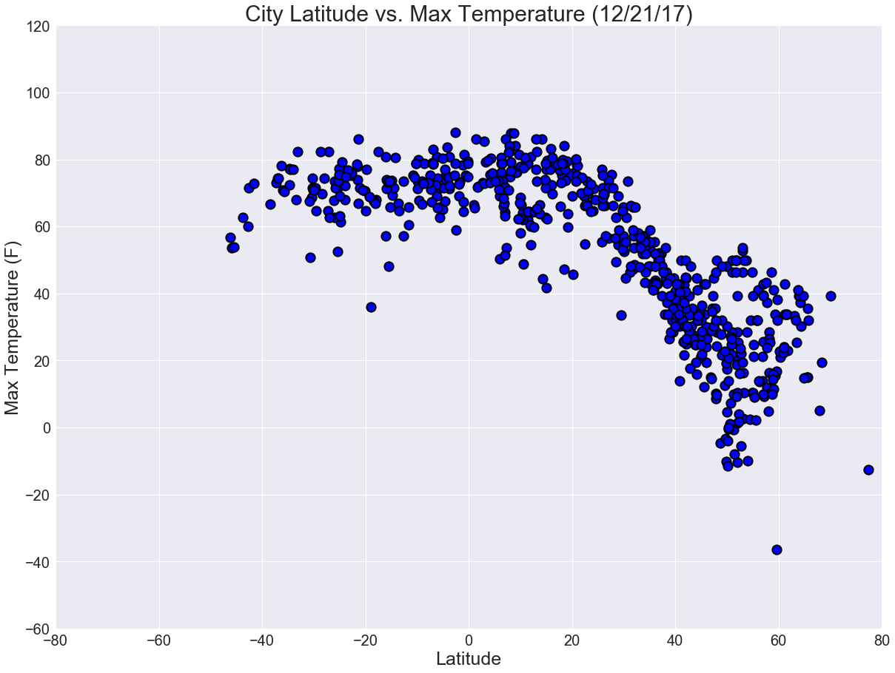
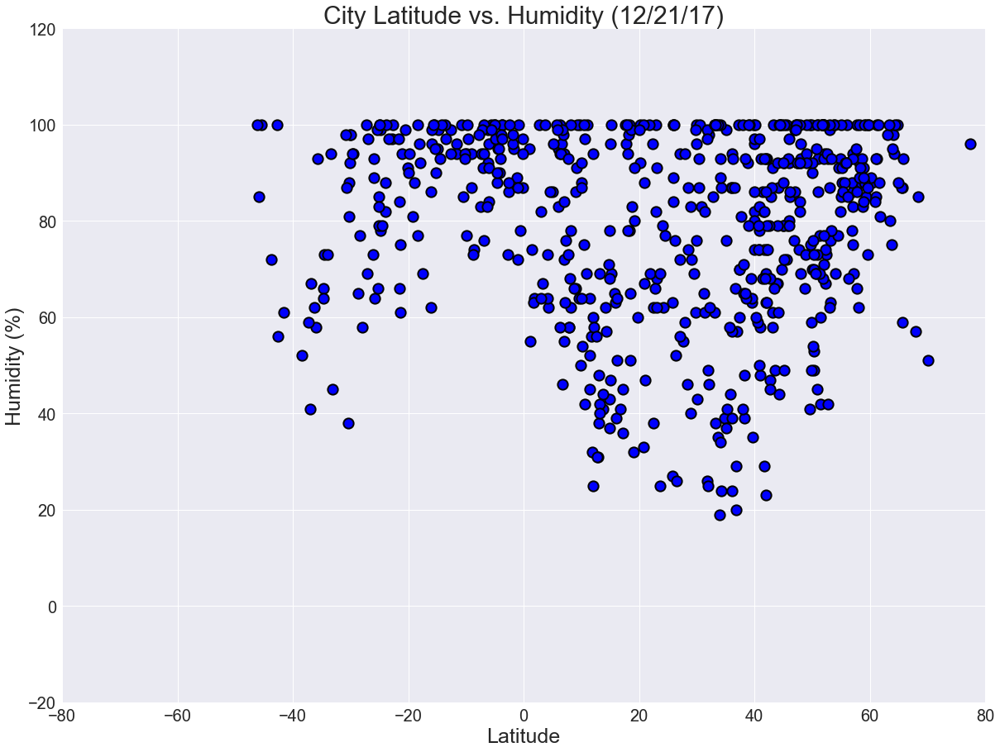
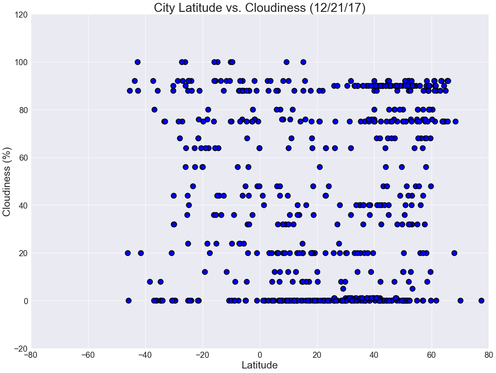
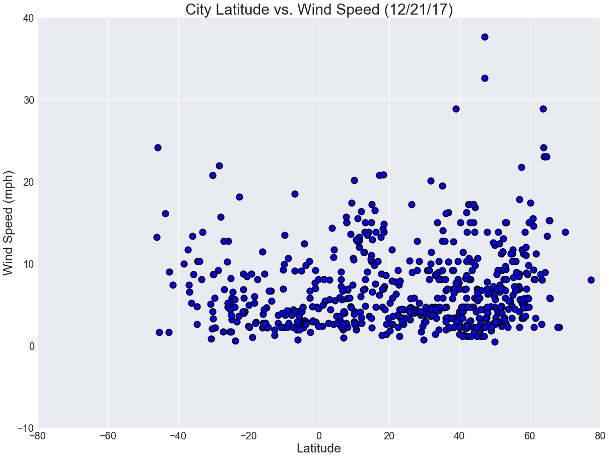

# Observed Trends
1) The max temperature peaks near the equator. When the latitude increases positively (towards North), the max temperature drops. 

2) Humidity and cloudiness do not seem to be correlated to latitude as there is a relatively uniform spread across the different latitude points. 

3) The majority of cities have a windspeed under 20 mph. 


```python
#Dependencies
import numpy as np
import pandas as pd
import matplotlib.pyplot as plt
import requests
import time
import random
!pip install citipy
from citipy import citipy
#set style for plots
plt.style.use("seaborn")

```

    Requirement already satisfied: citipy in /Users/sharonsu/anaconda/lib/python3.6/site-packages
    Requirement already satisfied: kdtree>=0.12 in /Users/sharonsu/anaconda/lib/python3.6/site-packages (from citipy)


# Representative Sample


```python
#Creating list of lats/lngs
lats = range(-90, 90)
lngs = range(-180, 180)
city_list = []
for lat in lats:
    for lng in lngs:
        city = citipy.nearest_city(lat, lng)
        city_name = city.city_name
        city_list.append(city_name)
# Do some cleaning (remove duplicates)
city_df = pd.DataFrame(city_list)
new_city_df = city_df.drop_duplicates()
```


```python
#Extracting sample cities
sampled_cities = new_city_df.sample(700)
sampled_cities = sampled_cities.reset_index(drop = True)
sampled_cities.columns = ["City"]
sampled_cities.index += 1 
sampled_cities["Lat"] = ""
sampled_cities["Lng"] = ""
sampled_cities["Country"] = ""
sampled_cities["Date"] = ""
sampled_cities["Max Temp"] = ""
sampled_cities["Humidity"] = ""
sampled_cities["Cloudiness"] = ""
sampled_cities["Wind Speed"] = ""
sampled_cities.head()
```


<div>
<style>
    .dataframe thead tr:only-child th {
        text-align: right;
    }

    .dataframe thead th {
        text-align: left;
    }

    .dataframe tbody tr th {
        vertical-align: top;
    }
</style>
<table border="1" class="dataframe">
  <thead>
    <tr style="text-align: right;">
      <th></th>
      <th>City</th>
      <th>Lat</th>
      <th>Lng</th>
      <th>Country</th>
      <th>Date</th>
      <th>Max Temp</th>
      <th>Humidity</th>
      <th>Cloudiness</th>
      <th>Wind Speed</th>
    </tr>
  </thead>
  <tbody>
    <tr>
      <th>1</th>
      <td>seredka</td>
      <td></td>
      <td></td>
      <td></td>
      <td></td>
      <td></td>
      <td></td>
      <td></td>
      <td></td>
    </tr>
    <tr>
      <th>2</th>
      <td>nikolayevsk-na-amure</td>
      <td></td>
      <td></td>
      <td></td>
      <td></td>
      <td></td>
      <td></td>
      <td></td>
      <td></td>
    </tr>
    <tr>
      <th>3</th>
      <td>qingdao</td>
      <td></td>
      <td></td>
      <td></td>
      <td></td>
      <td></td>
      <td></td>
      <td></td>
      <td></td>
    </tr>
    <tr>
      <th>4</th>
      <td>kumukh</td>
      <td></td>
      <td></td>
      <td></td>
      <td></td>
      <td></td>
      <td></td>
      <td></td>
      <td></td>
    </tr>
    <tr>
      <th>5</th>
      <td>were ilu</td>
      <td></td>
      <td></td>
      <td></td>
      <td></td>
      <td></td>
      <td></td>
      <td></td>
      <td></td>
    </tr>
  </tbody>
</table>
</div>


# OpenWeatherMap API Weather Check


```python
filename = 'apikey'
def get_file_contents(filename):
    try:
        with open(filename, 'r') as f:
            return f.read().strip()
    except FileNotFoundError:
        print("'%s' file not found" % filename)
api_key = get_file_contents(filename)
```


```python
units = "Imperial"
print("Beginning Data Retrieval")
print("-------------------------------")
for index,row in sampled_cities.iterrows():
    city_name = row["City"]
    city_url_name = city_name.replace(" ", "%20")
    target_url = "http://api.openweathermap.org/data/2.5/weather?units=%s&APPID=%s&q=%s" % (units, api_key, city_url_name)
    city_weather = requests.get(target_url).json()
    sampled_cities.set_value(index,"Lat",city_weather.get("coord",{}).get("lat"))
    sampled_cities.set_value(index,"Lng",city_weather.get("coord",{}).get("lon"))
    sampled_cities.set_value(index,"Country",city_weather.get("sys",{}).get("country"))
    sampled_cities.set_value(index,"Date",city_weather.get("dt",{}))
    sampled_cities.set_value(index,"Max Temp",city_weather.get("main",{}).get("temp_max"))
    sampled_cities.set_value(index,"Humidity",city_weather.get("main",{}).get("humidity"))
    sampled_cities.set_value(index,"Cloudiness",city_weather.get("clouds",{}).get("all"))
    sampled_cities.set_value(index,"Wind Speed",city_weather.get("wind",{}).get("speed"))
    print("Processing Record " + str(index) + " of 700 | " + str(city_name))
    print_url = "http://api.openweathermap.org/data/2.5/weather?units=%s&APPID=%s&q=%s" % (units, "api_id", city_url_name)
    print(print_url)
print("-------------------------------")
print("Data Retrieval Complete")
print("-------------------------------")

```

    Beginning Data Retrieval
    -------------------------------
    Processing Record 1 of 700 | seredka
    http://api.openweathermap.org/data/2.5/weather?units=Imperial&APPID=api_id&q=seredka
    Processing Record 2 of 700 | nikolayevsk-na-amure
    http://api.openweathermap.org/data/2.5/weather?units=Imperial&APPID=api_id&q=nikolayevsk-na-amure
    Processing Record 3 of 700 | qingdao
    http://api.openweathermap.org/data/2.5/weather?units=Imperial&APPID=api_id&q=qingdao
    Processing Record 4 of 700 | kumukh
    http://api.openweathermap.org/data/2.5/weather?units=Imperial&APPID=api_id&q=kumukh
    Processing Record 5 of 700 | were ilu
    http://api.openweathermap.org/data/2.5/weather?units=Imperial&APPID=api_id&q=were%20ilu
    Processing Record 6 of 700 | jatai
    http://api.openweathermap.org/data/2.5/weather?units=Imperial&APPID=api_id&q=jatai
    Processing Record 7 of 700 | saint anthony
    http://api.openweathermap.org/data/2.5/weather?units=Imperial&APPID=api_id&q=saint%20anthony
    Processing Record 8 of 700 | bahia de caraquez
    http://api.openweathermap.org/data/2.5/weather?units=Imperial&APPID=api_id&q=bahia%20de%20caraquez
    Processing Record 9 of 700 | salta
    http://api.openweathermap.org/data/2.5/weather?units=Imperial&APPID=api_id&q=salta
    Processing Record 10 of 700 | pervouralsk
    http://api.openweathermap.org/data/2.5/weather?units=Imperial&APPID=api_id&q=pervouralsk
    Processing Record 11 of 700 | grand forks
    http://api.openweathermap.org/data/2.5/weather?units=Imperial&APPID=api_id&q=grand%20forks
    Processing Record 12 of 700 | bhinga
    http://api.openweathermap.org/data/2.5/weather?units=Imperial&APPID=api_id&q=bhinga
    Processing Record 13 of 700 | carmarthen
    http://api.openweathermap.org/data/2.5/weather?units=Imperial&APPID=api_id&q=carmarthen
    Processing Record 14 of 700 | haverfordwest
    http://api.openweathermap.org/data/2.5/weather?units=Imperial&APPID=api_id&q=haverfordwest
    Processing Record 15 of 700 | musenita
    http://api.openweathermap.org/data/2.5/weather?units=Imperial&APPID=api_id&q=musenita
    Processing Record 16 of 700 | santa cruz de tenerife
    http://api.openweathermap.org/data/2.5/weather?units=Imperial&APPID=api_id&q=santa%20cruz%20de%20tenerife
    Processing Record 17 of 700 | savinka
    http://api.openweathermap.org/data/2.5/weather?units=Imperial&APPID=api_id&q=savinka
    Processing Record 18 of 700 | boshnyakovo
    http://api.openweathermap.org/data/2.5/weather?units=Imperial&APPID=api_id&q=boshnyakovo
    Processing Record 19 of 700 | nyuksenitsa
    http://api.openweathermap.org/data/2.5/weather?units=Imperial&APPID=api_id&q=nyuksenitsa
    Processing Record 20 of 700 | siyabuswa
    http://api.openweathermap.org/data/2.5/weather?units=Imperial&APPID=api_id&q=siyabuswa
    Processing Record 21 of 700 | itarema
    http://api.openweathermap.org/data/2.5/weather?units=Imperial&APPID=api_id&q=itarema
    Processing Record 22 of 700 | nautla
    http://api.openweathermap.org/data/2.5/weather?units=Imperial&APPID=api_id&q=nautla
    Processing Record 23 of 700 | cabadiangan
    http://api.openweathermap.org/data/2.5/weather?units=Imperial&APPID=api_id&q=cabadiangan
    Processing Record 24 of 700 | capitao poco
    http://api.openweathermap.org/data/2.5/weather?units=Imperial&APPID=api_id&q=capitao%20poco
    Processing Record 25 of 700 | katsuura
    http://api.openweathermap.org/data/2.5/weather?units=Imperial&APPID=api_id&q=katsuura
    Processing Record 26 of 700 | heze
    http://api.openweathermap.org/data/2.5/weather?units=Imperial&APPID=api_id&q=heze
    Processing Record 27 of 700 | sampit
    http://api.openweathermap.org/data/2.5/weather?units=Imperial&APPID=api_id&q=sampit
    Processing Record 28 of 700 | puerto gaitan
    http://api.openweathermap.org/data/2.5/weather?units=Imperial&APPID=api_id&q=puerto%20gaitan
    Processing Record 29 of 700 | poplar bluff
    http://api.openweathermap.org/data/2.5/weather?units=Imperial&APPID=api_id&q=poplar%20bluff
    Processing Record 30 of 700 | ejea de los caballeros
    http://api.openweathermap.org/data/2.5/weather?units=Imperial&APPID=api_id&q=ejea%20de%20los%20caballeros
    Processing Record 31 of 700 | borba
    http://api.openweathermap.org/data/2.5/weather?units=Imperial&APPID=api_id&q=borba
    Processing Record 32 of 700 | kanevskaya
    http://api.openweathermap.org/data/2.5/weather?units=Imperial&APPID=api_id&q=kanevskaya
    Processing Record 33 of 700 | ryotsu
    http://api.openweathermap.org/data/2.5/weather?units=Imperial&APPID=api_id&q=ryotsu
    Processing Record 34 of 700 | east wenatchee
    http://api.openweathermap.org/data/2.5/weather?units=Imperial&APPID=api_id&q=east%20wenatchee
    Processing Record 35 of 700 | atlantic city
    http://api.openweathermap.org/data/2.5/weather?units=Imperial&APPID=api_id&q=atlantic%20city
    Processing Record 36 of 700 | khor
    http://api.openweathermap.org/data/2.5/weather?units=Imperial&APPID=api_id&q=khor
    Processing Record 37 of 700 | winona
    http://api.openweathermap.org/data/2.5/weather?units=Imperial&APPID=api_id&q=winona
    Processing Record 38 of 700 | almansa
    http://api.openweathermap.org/data/2.5/weather?units=Imperial&APPID=api_id&q=almansa
    Processing Record 39 of 700 | abai
    http://api.openweathermap.org/data/2.5/weather?units=Imperial&APPID=api_id&q=abai
    Processing Record 40 of 700 | vyshestebliyevskaya
    http://api.openweathermap.org/data/2.5/weather?units=Imperial&APPID=api_id&q=vyshestebliyevskaya
    Processing Record 41 of 700 | shobara
    http://api.openweathermap.org/data/2.5/weather?units=Imperial&APPID=api_id&q=shobara
    Processing Record 42 of 700 | mingyue
    http://api.openweathermap.org/data/2.5/weather?units=Imperial&APPID=api_id&q=mingyue
    Processing Record 43 of 700 | fryazino
    http://api.openweathermap.org/data/2.5/weather?units=Imperial&APPID=api_id&q=fryazino
    Processing Record 44 of 700 | maghama
    http://api.openweathermap.org/data/2.5/weather?units=Imperial&APPID=api_id&q=maghama
    Processing Record 45 of 700 | bazarnyye mataki
    http://api.openweathermap.org/data/2.5/weather?units=Imperial&APPID=api_id&q=bazarnyye%20mataki
    Processing Record 46 of 700 | ivanovo
    http://api.openweathermap.org/data/2.5/weather?units=Imperial&APPID=api_id&q=ivanovo
    Processing Record 47 of 700 | yurla
    http://api.openweathermap.org/data/2.5/weather?units=Imperial&APPID=api_id&q=yurla
    Processing Record 48 of 700 | saquena
    http://api.openweathermap.org/data/2.5/weather?units=Imperial&APPID=api_id&q=saquena
    Processing Record 49 of 700 | cabanbanan
    http://api.openweathermap.org/data/2.5/weather?units=Imperial&APPID=api_id&q=cabanbanan
    Processing Record 50 of 700 | tahoua
    http://api.openweathermap.org/data/2.5/weather?units=Imperial&APPID=api_id&q=tahoua
    Processing Record 51 of 700 | siedlce
    http://api.openweathermap.org/data/2.5/weather?units=Imperial&APPID=api_id&q=siedlce
    Processing Record 52 of 700 | pawai
    http://api.openweathermap.org/data/2.5/weather?units=Imperial&APPID=api_id&q=pawai
    Processing Record 53 of 700 | comodoro rivadavia
    http://api.openweathermap.org/data/2.5/weather?units=Imperial&APPID=api_id&q=comodoro%20rivadavia
    Processing Record 54 of 700 | kanjiza
    http://api.openweathermap.org/data/2.5/weather?units=Imperial&APPID=api_id&q=kanjiza
    Processing Record 55 of 700 | hoyanger
    http://api.openweathermap.org/data/2.5/weather?units=Imperial&APPID=api_id&q=hoyanger
    Processing Record 56 of 700 | gremyachye
    http://api.openweathermap.org/data/2.5/weather?units=Imperial&APPID=api_id&q=gremyachye
    Processing Record 57 of 700 | tonk
    http://api.openweathermap.org/data/2.5/weather?units=Imperial&APPID=api_id&q=tonk
    Processing Record 58 of 700 | colinas
    http://api.openweathermap.org/data/2.5/weather?units=Imperial&APPID=api_id&q=colinas
    Processing Record 59 of 700 | staryy nadym
    http://api.openweathermap.org/data/2.5/weather?units=Imperial&APPID=api_id&q=staryy%20nadym
    Processing Record 60 of 700 | coffs harbour
    http://api.openweathermap.org/data/2.5/weather?units=Imperial&APPID=api_id&q=coffs%20harbour
    Processing Record 61 of 700 | kirensk
    http://api.openweathermap.org/data/2.5/weather?units=Imperial&APPID=api_id&q=kirensk
    Processing Record 62 of 700 | pata
    http://api.openweathermap.org/data/2.5/weather?units=Imperial&APPID=api_id&q=pata
    Processing Record 63 of 700 | bucyrus
    http://api.openweathermap.org/data/2.5/weather?units=Imperial&APPID=api_id&q=bucyrus
    Processing Record 64 of 700 | gonda
    http://api.openweathermap.org/data/2.5/weather?units=Imperial&APPID=api_id&q=gonda
    Processing Record 65 of 700 | betanzos
    http://api.openweathermap.org/data/2.5/weather?units=Imperial&APPID=api_id&q=betanzos
    Processing Record 66 of 700 | imabari
    http://api.openweathermap.org/data/2.5/weather?units=Imperial&APPID=api_id&q=imabari
    Processing Record 67 of 700 | ibicui
    http://api.openweathermap.org/data/2.5/weather?units=Imperial&APPID=api_id&q=ibicui
    Processing Record 68 of 700 | kilkis
    http://api.openweathermap.org/data/2.5/weather?units=Imperial&APPID=api_id&q=kilkis
    Processing Record 69 of 700 | nederland
    http://api.openweathermap.org/data/2.5/weather?units=Imperial&APPID=api_id&q=nederland
    Processing Record 70 of 700 | omutinskoye
    http://api.openweathermap.org/data/2.5/weather?units=Imperial&APPID=api_id&q=omutinskoye
    Processing Record 71 of 700 | cintalapa
    http://api.openweathermap.org/data/2.5/weather?units=Imperial&APPID=api_id&q=cintalapa
    Processing Record 72 of 700 | dauriya
    http://api.openweathermap.org/data/2.5/weather?units=Imperial&APPID=api_id&q=dauriya
    Processing Record 73 of 700 | xicotencatl
    http://api.openweathermap.org/data/2.5/weather?units=Imperial&APPID=api_id&q=xicotencatl
    Processing Record 74 of 700 | ruwi
    http://api.openweathermap.org/data/2.5/weather?units=Imperial&APPID=api_id&q=ruwi
    Processing Record 75 of 700 | cerinza
    http://api.openweathermap.org/data/2.5/weather?units=Imperial&APPID=api_id&q=cerinza
    Processing Record 76 of 700 | zemio
    http://api.openweathermap.org/data/2.5/weather?units=Imperial&APPID=api_id&q=zemio
    Processing Record 77 of 700 | one hundred mile house
    http://api.openweathermap.org/data/2.5/weather?units=Imperial&APPID=api_id&q=one%20hundred%20mile%20house
    Processing Record 78 of 700 | kandrian
    http://api.openweathermap.org/data/2.5/weather?units=Imperial&APPID=api_id&q=kandrian
    Processing Record 79 of 700 | phalaborwa
    http://api.openweathermap.org/data/2.5/weather?units=Imperial&APPID=api_id&q=phalaborwa
    Processing Record 80 of 700 | corinto
    http://api.openweathermap.org/data/2.5/weather?units=Imperial&APPID=api_id&q=corinto
    Processing Record 81 of 700 | lichtenburg
    http://api.openweathermap.org/data/2.5/weather?units=Imperial&APPID=api_id&q=lichtenburg
    Processing Record 82 of 700 | kormilovka
    http://api.openweathermap.org/data/2.5/weather?units=Imperial&APPID=api_id&q=kormilovka
    Processing Record 83 of 700 | fernley
    http://api.openweathermap.org/data/2.5/weather?units=Imperial&APPID=api_id&q=fernley
    Processing Record 84 of 700 | jardim
    http://api.openweathermap.org/data/2.5/weather?units=Imperial&APPID=api_id&q=jardim
    Processing Record 85 of 700 | gaurnadi
    http://api.openweathermap.org/data/2.5/weather?units=Imperial&APPID=api_id&q=gaurnadi
    Processing Record 86 of 700 | bang lamung
    http://api.openweathermap.org/data/2.5/weather?units=Imperial&APPID=api_id&q=bang%20lamung
    Processing Record 87 of 700 | mmabatho
    http://api.openweathermap.org/data/2.5/weather?units=Imperial&APPID=api_id&q=mmabatho
    Processing Record 88 of 700 | sabya
    http://api.openweathermap.org/data/2.5/weather?units=Imperial&APPID=api_id&q=sabya
    Processing Record 89 of 700 | astaneh-ye ashrafiyeh
    http://api.openweathermap.org/data/2.5/weather?units=Imperial&APPID=api_id&q=astaneh-ye%20ashrafiyeh
    Processing Record 90 of 700 | santa margherita ligure
    http://api.openweathermap.org/data/2.5/weather?units=Imperial&APPID=api_id&q=santa%20margherita%20ligure
    Processing Record 91 of 700 | businga
    http://api.openweathermap.org/data/2.5/weather?units=Imperial&APPID=api_id&q=businga
    Processing Record 92 of 700 | karauzyak
    http://api.openweathermap.org/data/2.5/weather?units=Imperial&APPID=api_id&q=karauzyak
    Processing Record 93 of 700 | jucurutu
    http://api.openweathermap.org/data/2.5/weather?units=Imperial&APPID=api_id&q=jucurutu
    Processing Record 94 of 700 | hermosillo
    http://api.openweathermap.org/data/2.5/weather?units=Imperial&APPID=api_id&q=hermosillo
    Processing Record 95 of 700 | sangin
    http://api.openweathermap.org/data/2.5/weather?units=Imperial&APPID=api_id&q=sangin
    Processing Record 96 of 700 | ambikapur
    http://api.openweathermap.org/data/2.5/weather?units=Imperial&APPID=api_id&q=ambikapur
    Processing Record 97 of 700 | elk point
    http://api.openweathermap.org/data/2.5/weather?units=Imperial&APPID=api_id&q=elk%20point
    Processing Record 98 of 700 | gushikawa
    http://api.openweathermap.org/data/2.5/weather?units=Imperial&APPID=api_id&q=gushikawa
    Processing Record 99 of 700 | pendleton
    http://api.openweathermap.org/data/2.5/weather?units=Imperial&APPID=api_id&q=pendleton
    Processing Record 100 of 700 | mooi river
    http://api.openweathermap.org/data/2.5/weather?units=Imperial&APPID=api_id&q=mooi%20river
    Processing Record 101 of 700 | miramar
    http://api.openweathermap.org/data/2.5/weather?units=Imperial&APPID=api_id&q=miramar
    Processing Record 102 of 700 | mutis
    http://api.openweathermap.org/data/2.5/weather?units=Imperial&APPID=api_id&q=mutis
    Processing Record 103 of 700 | mali
    http://api.openweathermap.org/data/2.5/weather?units=Imperial&APPID=api_id&q=mali
    Processing Record 104 of 700 | los alamos
    http://api.openweathermap.org/data/2.5/weather?units=Imperial&APPID=api_id&q=los%20alamos
    Processing Record 105 of 700 | kristinehamn
    http://api.openweathermap.org/data/2.5/weather?units=Imperial&APPID=api_id&q=kristinehamn
    Processing Record 106 of 700 | drexel heights
    http://api.openweathermap.org/data/2.5/weather?units=Imperial&APPID=api_id&q=drexel%20heights
    Processing Record 107 of 700 | brownsville
    http://api.openweathermap.org/data/2.5/weather?units=Imperial&APPID=api_id&q=brownsville
    Processing Record 108 of 700 | santa ines
    http://api.openweathermap.org/data/2.5/weather?units=Imperial&APPID=api_id&q=santa%20ines
    Processing Record 109 of 700 | jonkoping
    http://api.openweathermap.org/data/2.5/weather?units=Imperial&APPID=api_id&q=jonkoping
    Processing Record 110 of 700 | telde
    http://api.openweathermap.org/data/2.5/weather?units=Imperial&APPID=api_id&q=telde
    Processing Record 111 of 700 | bada
    http://api.openweathermap.org/data/2.5/weather?units=Imperial&APPID=api_id&q=bada
    Processing Record 112 of 700 | narrabri
    http://api.openweathermap.org/data/2.5/weather?units=Imperial&APPID=api_id&q=narrabri
    Processing Record 113 of 700 | gamboma
    http://api.openweathermap.org/data/2.5/weather?units=Imperial&APPID=api_id&q=gamboma
    Processing Record 114 of 700 | selenduma
    http://api.openweathermap.org/data/2.5/weather?units=Imperial&APPID=api_id&q=selenduma
    Processing Record 115 of 700 | varhaug
    http://api.openweathermap.org/data/2.5/weather?units=Imperial&APPID=api_id&q=varhaug
    Processing Record 116 of 700 | timbiqui
    http://api.openweathermap.org/data/2.5/weather?units=Imperial&APPID=api_id&q=timbiqui
    Processing Record 117 of 700 | vondrozo
    http://api.openweathermap.org/data/2.5/weather?units=Imperial&APPID=api_id&q=vondrozo
    Processing Record 118 of 700 | davila
    http://api.openweathermap.org/data/2.5/weather?units=Imperial&APPID=api_id&q=davila
    Processing Record 119 of 700 | balotra
    http://api.openweathermap.org/data/2.5/weather?units=Imperial&APPID=api_id&q=balotra
    Processing Record 120 of 700 | cidreira
    http://api.openweathermap.org/data/2.5/weather?units=Imperial&APPID=api_id&q=cidreira
    Processing Record 121 of 700 | tierralta
    http://api.openweathermap.org/data/2.5/weather?units=Imperial&APPID=api_id&q=tierralta
    Processing Record 122 of 700 | goulburn
    http://api.openweathermap.org/data/2.5/weather?units=Imperial&APPID=api_id&q=goulburn
    Processing Record 123 of 700 | the valley
    http://api.openweathermap.org/data/2.5/weather?units=Imperial&APPID=api_id&q=the%20valley
    Processing Record 124 of 700 | inuvik
    http://api.openweathermap.org/data/2.5/weather?units=Imperial&APPID=api_id&q=inuvik
    Processing Record 125 of 700 | linqing
    http://api.openweathermap.org/data/2.5/weather?units=Imperial&APPID=api_id&q=linqing
    Processing Record 126 of 700 | jenks
    http://api.openweathermap.org/data/2.5/weather?units=Imperial&APPID=api_id&q=jenks
    Processing Record 127 of 700 | mandapam
    http://api.openweathermap.org/data/2.5/weather?units=Imperial&APPID=api_id&q=mandapam
    Processing Record 128 of 700 | cedar rapids
    http://api.openweathermap.org/data/2.5/weather?units=Imperial&APPID=api_id&q=cedar%20rapids
    Processing Record 129 of 700 | tolaga bay
    http://api.openweathermap.org/data/2.5/weather?units=Imperial&APPID=api_id&q=tolaga%20bay
    Processing Record 130 of 700 | macia
    http://api.openweathermap.org/data/2.5/weather?units=Imperial&APPID=api_id&q=macia
    Processing Record 131 of 700 | karatau
    http://api.openweathermap.org/data/2.5/weather?units=Imperial&APPID=api_id&q=karatau
    Processing Record 132 of 700 | shakawe
    http://api.openweathermap.org/data/2.5/weather?units=Imperial&APPID=api_id&q=shakawe
    Processing Record 133 of 700 | si sa ket
    http://api.openweathermap.org/data/2.5/weather?units=Imperial&APPID=api_id&q=si%20sa%20ket
    Processing Record 134 of 700 | sovetskaya
    http://api.openweathermap.org/data/2.5/weather?units=Imperial&APPID=api_id&q=sovetskaya
    Processing Record 135 of 700 | mantua
    http://api.openweathermap.org/data/2.5/weather?units=Imperial&APPID=api_id&q=mantua
    Processing Record 136 of 700 | lithgow
    http://api.openweathermap.org/data/2.5/weather?units=Imperial&APPID=api_id&q=lithgow
    Processing Record 137 of 700 | amboise
    http://api.openweathermap.org/data/2.5/weather?units=Imperial&APPID=api_id&q=amboise
    Processing Record 138 of 700 | svencioneliai
    http://api.openweathermap.org/data/2.5/weather?units=Imperial&APPID=api_id&q=svencioneliai
    Processing Record 139 of 700 | putina
    http://api.openweathermap.org/data/2.5/weather?units=Imperial&APPID=api_id&q=putina
    Processing Record 140 of 700 | moissac
    http://api.openweathermap.org/data/2.5/weather?units=Imperial&APPID=api_id&q=moissac
    Processing Record 141 of 700 | provost
    http://api.openweathermap.org/data/2.5/weather?units=Imperial&APPID=api_id&q=provost
    Processing Record 142 of 700 | bosobolo
    http://api.openweathermap.org/data/2.5/weather?units=Imperial&APPID=api_id&q=bosobolo
    Processing Record 143 of 700 | rio do sul
    http://api.openweathermap.org/data/2.5/weather?units=Imperial&APPID=api_id&q=rio%20do%20sul
    Processing Record 144 of 700 | angouleme
    http://api.openweathermap.org/data/2.5/weather?units=Imperial&APPID=api_id&q=angouleme
    Processing Record 145 of 700 | oktyabrskiy
    http://api.openweathermap.org/data/2.5/weather?units=Imperial&APPID=api_id&q=oktyabrskiy
    Processing Record 146 of 700 | potiskum
    http://api.openweathermap.org/data/2.5/weather?units=Imperial&APPID=api_id&q=potiskum
    Processing Record 147 of 700 | abu kamal
    http://api.openweathermap.org/data/2.5/weather?units=Imperial&APPID=api_id&q=abu%20kamal
    Processing Record 148 of 700 | nakhon ratchasima
    http://api.openweathermap.org/data/2.5/weather?units=Imperial&APPID=api_id&q=nakhon%20ratchasima
    Processing Record 149 of 700 | ulaangom
    http://api.openweathermap.org/data/2.5/weather?units=Imperial&APPID=api_id&q=ulaangom
    Processing Record 150 of 700 | xian
    http://api.openweathermap.org/data/2.5/weather?units=Imperial&APPID=api_id&q=xian
    Processing Record 151 of 700 | castro
    http://api.openweathermap.org/data/2.5/weather?units=Imperial&APPID=api_id&q=castro
    Processing Record 152 of 700 | biak
    http://api.openweathermap.org/data/2.5/weather?units=Imperial&APPID=api_id&q=biak
    Processing Record 153 of 700 | marolambo
    http://api.openweathermap.org/data/2.5/weather?units=Imperial&APPID=api_id&q=marolambo
    Processing Record 154 of 700 | bikin
    http://api.openweathermap.org/data/2.5/weather?units=Imperial&APPID=api_id&q=bikin
    Processing Record 155 of 700 | shenzhen
    http://api.openweathermap.org/data/2.5/weather?units=Imperial&APPID=api_id&q=shenzhen
    Processing Record 156 of 700 | lloydminster
    http://api.openweathermap.org/data/2.5/weather?units=Imperial&APPID=api_id&q=lloydminster
    Processing Record 157 of 700 | bealanana
    http://api.openweathermap.org/data/2.5/weather?units=Imperial&APPID=api_id&q=bealanana
    Processing Record 158 of 700 | arroyo
    http://api.openweathermap.org/data/2.5/weather?units=Imperial&APPID=api_id&q=arroyo
    Processing Record 159 of 700 | quang ngai
    http://api.openweathermap.org/data/2.5/weather?units=Imperial&APPID=api_id&q=quang%20ngai
    Processing Record 160 of 700 | rio branco
    http://api.openweathermap.org/data/2.5/weather?units=Imperial&APPID=api_id&q=rio%20branco
    Processing Record 161 of 700 | vizinga
    http://api.openweathermap.org/data/2.5/weather?units=Imperial&APPID=api_id&q=vizinga
    Processing Record 162 of 700 | kyabram
    http://api.openweathermap.org/data/2.5/weather?units=Imperial&APPID=api_id&q=kyabram
    Processing Record 163 of 700 | quimper
    http://api.openweathermap.org/data/2.5/weather?units=Imperial&APPID=api_id&q=quimper
    Processing Record 164 of 700 | bongaree
    http://api.openweathermap.org/data/2.5/weather?units=Imperial&APPID=api_id&q=bongaree
    Processing Record 165 of 700 | rossland
    http://api.openweathermap.org/data/2.5/weather?units=Imperial&APPID=api_id&q=rossland
    Processing Record 166 of 700 | quzhou
    http://api.openweathermap.org/data/2.5/weather?units=Imperial&APPID=api_id&q=quzhou
    Processing Record 167 of 700 | orange walk
    http://api.openweathermap.org/data/2.5/weather?units=Imperial&APPID=api_id&q=orange%20walk
    Processing Record 168 of 700 | tepalcatepec
    http://api.openweathermap.org/data/2.5/weather?units=Imperial&APPID=api_id&q=tepalcatepec
    Processing Record 169 of 700 | birr
    http://api.openweathermap.org/data/2.5/weather?units=Imperial&APPID=api_id&q=birr
    Processing Record 170 of 700 | artvin
    http://api.openweathermap.org/data/2.5/weather?units=Imperial&APPID=api_id&q=artvin
    Processing Record 171 of 700 | attawapiskat
    http://api.openweathermap.org/data/2.5/weather?units=Imperial&APPID=api_id&q=attawapiskat
    Processing Record 172 of 700 | heishan
    http://api.openweathermap.org/data/2.5/weather?units=Imperial&APPID=api_id&q=heishan
    Processing Record 173 of 700 | consett
    http://api.openweathermap.org/data/2.5/weather?units=Imperial&APPID=api_id&q=consett
    Processing Record 174 of 700 | shouguang
    http://api.openweathermap.org/data/2.5/weather?units=Imperial&APPID=api_id&q=shouguang
    Processing Record 175 of 700 | lefka
    http://api.openweathermap.org/data/2.5/weather?units=Imperial&APPID=api_id&q=lefka
    Processing Record 176 of 700 | hanmer springs
    http://api.openweathermap.org/data/2.5/weather?units=Imperial&APPID=api_id&q=hanmer%20springs
    Processing Record 177 of 700 | arkadelphia
    http://api.openweathermap.org/data/2.5/weather?units=Imperial&APPID=api_id&q=arkadelphia
    Processing Record 178 of 700 | ojinaga
    http://api.openweathermap.org/data/2.5/weather?units=Imperial&APPID=api_id&q=ojinaga
    Processing Record 179 of 700 | itaituba
    http://api.openweathermap.org/data/2.5/weather?units=Imperial&APPID=api_id&q=itaituba
    Processing Record 180 of 700 | manokwari
    http://api.openweathermap.org/data/2.5/weather?units=Imperial&APPID=api_id&q=manokwari
    Processing Record 181 of 700 | tabory
    http://api.openweathermap.org/data/2.5/weather?units=Imperial&APPID=api_id&q=tabory
    Processing Record 182 of 700 | horasan
    http://api.openweathermap.org/data/2.5/weather?units=Imperial&APPID=api_id&q=horasan
    Processing Record 183 of 700 | brusyanskiy
    http://api.openweathermap.org/data/2.5/weather?units=Imperial&APPID=api_id&q=brusyanskiy
    Processing Record 184 of 700 | lipin bor
    http://api.openweathermap.org/data/2.5/weather?units=Imperial&APPID=api_id&q=lipin%20bor
    Processing Record 185 of 700 | cubara
    http://api.openweathermap.org/data/2.5/weather?units=Imperial&APPID=api_id&q=cubara
    Processing Record 186 of 700 | gondanglegi
    http://api.openweathermap.org/data/2.5/weather?units=Imperial&APPID=api_id&q=gondanglegi
    Processing Record 187 of 700 | guichicovi
    http://api.openweathermap.org/data/2.5/weather?units=Imperial&APPID=api_id&q=guichicovi
    Processing Record 188 of 700 | la sarre
    http://api.openweathermap.org/data/2.5/weather?units=Imperial&APPID=api_id&q=la%20sarre
    Processing Record 189 of 700 | susurluk
    http://api.openweathermap.org/data/2.5/weather?units=Imperial&APPID=api_id&q=susurluk
    Processing Record 190 of 700 | shirvan
    http://api.openweathermap.org/data/2.5/weather?units=Imperial&APPID=api_id&q=shirvan
    Processing Record 191 of 700 | konstancin-jeziorna
    http://api.openweathermap.org/data/2.5/weather?units=Imperial&APPID=api_id&q=konstancin-jeziorna
    Processing Record 192 of 700 | thika
    http://api.openweathermap.org/data/2.5/weather?units=Imperial&APPID=api_id&q=thika
    Processing Record 193 of 700 | dien bien
    http://api.openweathermap.org/data/2.5/weather?units=Imperial&APPID=api_id&q=dien%20bien
    Processing Record 194 of 700 | cangzhou
    http://api.openweathermap.org/data/2.5/weather?units=Imperial&APPID=api_id&q=cangzhou
    Processing Record 195 of 700 | skorodnoye
    http://api.openweathermap.org/data/2.5/weather?units=Imperial&APPID=api_id&q=skorodnoye
    Processing Record 196 of 700 | veseloyarsk
    http://api.openweathermap.org/data/2.5/weather?units=Imperial&APPID=api_id&q=veseloyarsk
    Processing Record 197 of 700 | jimma
    http://api.openweathermap.org/data/2.5/weather?units=Imperial&APPID=api_id&q=jimma
    Processing Record 198 of 700 | goryachegorsk
    http://api.openweathermap.org/data/2.5/weather?units=Imperial&APPID=api_id&q=goryachegorsk
    Processing Record 199 of 700 | dargaville
    http://api.openweathermap.org/data/2.5/weather?units=Imperial&APPID=api_id&q=dargaville
    Processing Record 200 of 700 | hollins
    http://api.openweathermap.org/data/2.5/weather?units=Imperial&APPID=api_id&q=hollins
    Processing Record 201 of 700 | butia
    http://api.openweathermap.org/data/2.5/weather?units=Imperial&APPID=api_id&q=butia
    Processing Record 202 of 700 | savinskiy
    http://api.openweathermap.org/data/2.5/weather?units=Imperial&APPID=api_id&q=savinskiy
    Processing Record 203 of 700 | chancay
    http://api.openweathermap.org/data/2.5/weather?units=Imperial&APPID=api_id&q=chancay
    Processing Record 204 of 700 | sikonge
    http://api.openweathermap.org/data/2.5/weather?units=Imperial&APPID=api_id&q=sikonge
    Processing Record 205 of 700 | ngaoundere
    http://api.openweathermap.org/data/2.5/weather?units=Imperial&APPID=api_id&q=ngaoundere
    Processing Record 206 of 700 | kadambur
    http://api.openweathermap.org/data/2.5/weather?units=Imperial&APPID=api_id&q=kadambur
    Processing Record 207 of 700 | svetlyy
    http://api.openweathermap.org/data/2.5/weather?units=Imperial&APPID=api_id&q=svetlyy
    Processing Record 208 of 700 | kingsland
    http://api.openweathermap.org/data/2.5/weather?units=Imperial&APPID=api_id&q=kingsland
    Processing Record 209 of 700 | lere
    http://api.openweathermap.org/data/2.5/weather?units=Imperial&APPID=api_id&q=lere
    Processing Record 210 of 700 | lyngdal
    http://api.openweathermap.org/data/2.5/weather?units=Imperial&APPID=api_id&q=lyngdal
    Processing Record 211 of 700 | changtu
    http://api.openweathermap.org/data/2.5/weather?units=Imperial&APPID=api_id&q=changtu
    Processing Record 212 of 700 | kohlu
    http://api.openweathermap.org/data/2.5/weather?units=Imperial&APPID=api_id&q=kohlu
    Processing Record 213 of 700 | juifang
    http://api.openweathermap.org/data/2.5/weather?units=Imperial&APPID=api_id&q=juifang
    Processing Record 214 of 700 | koulikoro
    http://api.openweathermap.org/data/2.5/weather?units=Imperial&APPID=api_id&q=koulikoro
    Processing Record 215 of 700 | guerrero
    http://api.openweathermap.org/data/2.5/weather?units=Imperial&APPID=api_id&q=guerrero
    Processing Record 216 of 700 | goiatuba
    http://api.openweathermap.org/data/2.5/weather?units=Imperial&APPID=api_id&q=goiatuba
    Processing Record 217 of 700 | zomin
    http://api.openweathermap.org/data/2.5/weather?units=Imperial&APPID=api_id&q=zomin
    Processing Record 218 of 700 | riom
    http://api.openweathermap.org/data/2.5/weather?units=Imperial&APPID=api_id&q=riom
    Processing Record 219 of 700 | khanu woralaksaburi
    http://api.openweathermap.org/data/2.5/weather?units=Imperial&APPID=api_id&q=khanu%20woralaksaburi
    Processing Record 220 of 700 | mungaa
    http://api.openweathermap.org/data/2.5/weather?units=Imperial&APPID=api_id&q=mungaa
    Processing Record 221 of 700 | turtas
    http://api.openweathermap.org/data/2.5/weather?units=Imperial&APPID=api_id&q=turtas
    Processing Record 222 of 700 | curillo
    http://api.openweathermap.org/data/2.5/weather?units=Imperial&APPID=api_id&q=curillo
    Processing Record 223 of 700 | snasa
    http://api.openweathermap.org/data/2.5/weather?units=Imperial&APPID=api_id&q=snasa
    Processing Record 224 of 700 | malwan
    http://api.openweathermap.org/data/2.5/weather?units=Imperial&APPID=api_id&q=malwan
    Processing Record 225 of 700 | noblesville
    http://api.openweathermap.org/data/2.5/weather?units=Imperial&APPID=api_id&q=noblesville
    Processing Record 226 of 700 | linfen
    http://api.openweathermap.org/data/2.5/weather?units=Imperial&APPID=api_id&q=linfen
    Processing Record 227 of 700 | tobol
    http://api.openweathermap.org/data/2.5/weather?units=Imperial&APPID=api_id&q=tobol
    Processing Record 228 of 700 | katakwi
    http://api.openweathermap.org/data/2.5/weather?units=Imperial&APPID=api_id&q=katakwi
    Processing Record 229 of 700 | tairua
    http://api.openweathermap.org/data/2.5/weather?units=Imperial&APPID=api_id&q=tairua
    Processing Record 230 of 700 | mbuji-mayi
    http://api.openweathermap.org/data/2.5/weather?units=Imperial&APPID=api_id&q=mbuji-mayi
    Processing Record 231 of 700 | san jose de buan
    http://api.openweathermap.org/data/2.5/weather?units=Imperial&APPID=api_id&q=san%20jose%20de%20buan
    Processing Record 232 of 700 | yongchang
    http://api.openweathermap.org/data/2.5/weather?units=Imperial&APPID=api_id&q=yongchang
    Processing Record 233 of 700 | ladwa
    http://api.openweathermap.org/data/2.5/weather?units=Imperial&APPID=api_id&q=ladwa
    Processing Record 234 of 700 | bursa
    http://api.openweathermap.org/data/2.5/weather?units=Imperial&APPID=api_id&q=bursa
    Processing Record 235 of 700 | barnstaple
    http://api.openweathermap.org/data/2.5/weather?units=Imperial&APPID=api_id&q=barnstaple
    Processing Record 236 of 700 | kristianstad
    http://api.openweathermap.org/data/2.5/weather?units=Imperial&APPID=api_id&q=kristianstad
    Processing Record 237 of 700 | minsk
    http://api.openweathermap.org/data/2.5/weather?units=Imperial&APPID=api_id&q=minsk
    Processing Record 238 of 700 | puri
    http://api.openweathermap.org/data/2.5/weather?units=Imperial&APPID=api_id&q=puri
    Processing Record 239 of 700 | sechenovo
    http://api.openweathermap.org/data/2.5/weather?units=Imperial&APPID=api_id&q=sechenovo
    Processing Record 240 of 700 | lluta
    http://api.openweathermap.org/data/2.5/weather?units=Imperial&APPID=api_id&q=lluta
    Processing Record 241 of 700 | sajoszoged
    http://api.openweathermap.org/data/2.5/weather?units=Imperial&APPID=api_id&q=sajoszoged
    Processing Record 242 of 700 | cruzeiro do sul
    http://api.openweathermap.org/data/2.5/weather?units=Imperial&APPID=api_id&q=cruzeiro%20do%20sul
    Processing Record 243 of 700 | quthing
    http://api.openweathermap.org/data/2.5/weather?units=Imperial&APPID=api_id&q=quthing
    Processing Record 244 of 700 | cerro cama
    http://api.openweathermap.org/data/2.5/weather?units=Imperial&APPID=api_id&q=cerro%20cama
    Processing Record 245 of 700 | zwedru
    http://api.openweathermap.org/data/2.5/weather?units=Imperial&APPID=api_id&q=zwedru
    Processing Record 246 of 700 | fairhope
    http://api.openweathermap.org/data/2.5/weather?units=Imperial&APPID=api_id&q=fairhope
    Processing Record 247 of 700 | carmen
    http://api.openweathermap.org/data/2.5/weather?units=Imperial&APPID=api_id&q=carmen
    Processing Record 248 of 700 | san jose
    http://api.openweathermap.org/data/2.5/weather?units=Imperial&APPID=api_id&q=san%20jose
    Processing Record 249 of 700 | venice
    http://api.openweathermap.org/data/2.5/weather?units=Imperial&APPID=api_id&q=venice
    Processing Record 250 of 700 | buckeye
    http://api.openweathermap.org/data/2.5/weather?units=Imperial&APPID=api_id&q=buckeye
    Processing Record 251 of 700 | nyrad
    http://api.openweathermap.org/data/2.5/weather?units=Imperial&APPID=api_id&q=nyrad
    Processing Record 252 of 700 | bokhan
    http://api.openweathermap.org/data/2.5/weather?units=Imperial&APPID=api_id&q=bokhan
    Processing Record 253 of 700 | north saint paul
    http://api.openweathermap.org/data/2.5/weather?units=Imperial&APPID=api_id&q=north%20saint%20paul
    Processing Record 254 of 700 | blythe
    http://api.openweathermap.org/data/2.5/weather?units=Imperial&APPID=api_id&q=blythe
    Processing Record 255 of 700 | balakhninskiy
    http://api.openweathermap.org/data/2.5/weather?units=Imperial&APPID=api_id&q=balakhninskiy
    Processing Record 256 of 700 | agdam
    http://api.openweathermap.org/data/2.5/weather?units=Imperial&APPID=api_id&q=agdam
    Processing Record 257 of 700 | kardla
    http://api.openweathermap.org/data/2.5/weather?units=Imperial&APPID=api_id&q=kardla
    Processing Record 258 of 700 | aqtobe
    http://api.openweathermap.org/data/2.5/weather?units=Imperial&APPID=api_id&q=aqtobe
    Processing Record 259 of 700 | matranovak
    http://api.openweathermap.org/data/2.5/weather?units=Imperial&APPID=api_id&q=matranovak
    Processing Record 260 of 700 | karakol
    http://api.openweathermap.org/data/2.5/weather?units=Imperial&APPID=api_id&q=karakol
    Processing Record 261 of 700 | manavalakurichi
    http://api.openweathermap.org/data/2.5/weather?units=Imperial&APPID=api_id&q=manavalakurichi
    Processing Record 262 of 700 | uruguaiana
    http://api.openweathermap.org/data/2.5/weather?units=Imperial&APPID=api_id&q=uruguaiana
    Processing Record 263 of 700 | upata
    http://api.openweathermap.org/data/2.5/weather?units=Imperial&APPID=api_id&q=upata
    Processing Record 264 of 700 | puerto maldonado
    http://api.openweathermap.org/data/2.5/weather?units=Imperial&APPID=api_id&q=puerto%20maldonado
    Processing Record 265 of 700 | nalut
    http://api.openweathermap.org/data/2.5/weather?units=Imperial&APPID=api_id&q=nalut
    Processing Record 266 of 700 | kabompo
    http://api.openweathermap.org/data/2.5/weather?units=Imperial&APPID=api_id&q=kabompo
    Processing Record 267 of 700 | fitionesti
    http://api.openweathermap.org/data/2.5/weather?units=Imperial&APPID=api_id&q=fitionesti
    Processing Record 268 of 700 | severnyy-kospashskiy
    http://api.openweathermap.org/data/2.5/weather?units=Imperial&APPID=api_id&q=severnyy-kospashskiy
    Processing Record 269 of 700 | udayagiri
    http://api.openweathermap.org/data/2.5/weather?units=Imperial&APPID=api_id&q=udayagiri
    Processing Record 270 of 700 | carikar
    http://api.openweathermap.org/data/2.5/weather?units=Imperial&APPID=api_id&q=carikar
    Processing Record 271 of 700 | bengkulu
    http://api.openweathermap.org/data/2.5/weather?units=Imperial&APPID=api_id&q=bengkulu
    Processing Record 272 of 700 | mudbidri
    http://api.openweathermap.org/data/2.5/weather?units=Imperial&APPID=api_id&q=mudbidri
    Processing Record 273 of 700 | byron bay
    http://api.openweathermap.org/data/2.5/weather?units=Imperial&APPID=api_id&q=byron%20bay
    Processing Record 274 of 700 | diest
    http://api.openweathermap.org/data/2.5/weather?units=Imperial&APPID=api_id&q=diest
    Processing Record 275 of 700 | tandil
    http://api.openweathermap.org/data/2.5/weather?units=Imperial&APPID=api_id&q=tandil
    Processing Record 276 of 700 | valkeakoski
    http://api.openweathermap.org/data/2.5/weather?units=Imperial&APPID=api_id&q=valkeakoski
    Processing Record 277 of 700 | jian
    http://api.openweathermap.org/data/2.5/weather?units=Imperial&APPID=api_id&q=jian
    Processing Record 278 of 700 | danshui
    http://api.openweathermap.org/data/2.5/weather?units=Imperial&APPID=api_id&q=danshui
    Processing Record 279 of 700 | belmonte
    http://api.openweathermap.org/data/2.5/weather?units=Imperial&APPID=api_id&q=belmonte
    Processing Record 280 of 700 | carutapera
    http://api.openweathermap.org/data/2.5/weather?units=Imperial&APPID=api_id&q=carutapera
    Processing Record 281 of 700 | sondrio
    http://api.openweathermap.org/data/2.5/weather?units=Imperial&APPID=api_id&q=sondrio
    Processing Record 282 of 700 | ceahlau
    http://api.openweathermap.org/data/2.5/weather?units=Imperial&APPID=api_id&q=ceahlau
    Processing Record 283 of 700 | izamal
    http://api.openweathermap.org/data/2.5/weather?units=Imperial&APPID=api_id&q=izamal
    Processing Record 284 of 700 | preston
    http://api.openweathermap.org/data/2.5/weather?units=Imperial&APPID=api_id&q=preston
    Processing Record 285 of 700 | cabanas
    http://api.openweathermap.org/data/2.5/weather?units=Imperial&APPID=api_id&q=cabanas
    Processing Record 286 of 700 | unguia
    http://api.openweathermap.org/data/2.5/weather?units=Imperial&APPID=api_id&q=unguia
    Processing Record 287 of 700 | singarayakonda
    http://api.openweathermap.org/data/2.5/weather?units=Imperial&APPID=api_id&q=singarayakonda
    Processing Record 288 of 700 | pompeu
    http://api.openweathermap.org/data/2.5/weather?units=Imperial&APPID=api_id&q=pompeu
    Processing Record 289 of 700 | gistrup
    http://api.openweathermap.org/data/2.5/weather?units=Imperial&APPID=api_id&q=gistrup
    Processing Record 290 of 700 | krasnyy chikoy
    http://api.openweathermap.org/data/2.5/weather?units=Imperial&APPID=api_id&q=krasnyy%20chikoy
    Processing Record 291 of 700 | east stroudsburg
    http://api.openweathermap.org/data/2.5/weather?units=Imperial&APPID=api_id&q=east%20stroudsburg
    Processing Record 292 of 700 | taseyevo
    http://api.openweathermap.org/data/2.5/weather?units=Imperial&APPID=api_id&q=taseyevo
    Processing Record 293 of 700 | mangai
    http://api.openweathermap.org/data/2.5/weather?units=Imperial&APPID=api_id&q=mangai
    Processing Record 294 of 700 | wazzan
    http://api.openweathermap.org/data/2.5/weather?units=Imperial&APPID=api_id&q=wazzan
    Processing Record 295 of 700 | mailsi
    http://api.openweathermap.org/data/2.5/weather?units=Imperial&APPID=api_id&q=mailsi
    Processing Record 296 of 700 | stillwater
    http://api.openweathermap.org/data/2.5/weather?units=Imperial&APPID=api_id&q=stillwater
    Processing Record 297 of 700 | batken
    http://api.openweathermap.org/data/2.5/weather?units=Imperial&APPID=api_id&q=batken
    Processing Record 298 of 700 | yarim
    http://api.openweathermap.org/data/2.5/weather?units=Imperial&APPID=api_id&q=yarim
    Processing Record 299 of 700 | samana
    http://api.openweathermap.org/data/2.5/weather?units=Imperial&APPID=api_id&q=samana
    Processing Record 300 of 700 | maloshuyka
    http://api.openweathermap.org/data/2.5/weather?units=Imperial&APPID=api_id&q=maloshuyka
    Processing Record 301 of 700 | bandipur
    http://api.openweathermap.org/data/2.5/weather?units=Imperial&APPID=api_id&q=bandipur
    Processing Record 302 of 700 | kamyzyak
    http://api.openweathermap.org/data/2.5/weather?units=Imperial&APPID=api_id&q=kamyzyak
    Processing Record 303 of 700 | worland
    http://api.openweathermap.org/data/2.5/weather?units=Imperial&APPID=api_id&q=worland
    Processing Record 304 of 700 | ilinskoye-khovanskoye
    http://api.openweathermap.org/data/2.5/weather?units=Imperial&APPID=api_id&q=ilinskoye-khovanskoye
    Processing Record 305 of 700 | banyo
    http://api.openweathermap.org/data/2.5/weather?units=Imperial&APPID=api_id&q=banyo
    Processing Record 306 of 700 | tuggurt
    http://api.openweathermap.org/data/2.5/weather?units=Imperial&APPID=api_id&q=tuggurt
    Processing Record 307 of 700 | kasangulu
    http://api.openweathermap.org/data/2.5/weather?units=Imperial&APPID=api_id&q=kasangulu
    Processing Record 308 of 700 | uva
    http://api.openweathermap.org/data/2.5/weather?units=Imperial&APPID=api_id&q=uva
    Processing Record 309 of 700 | gewane
    http://api.openweathermap.org/data/2.5/weather?units=Imperial&APPID=api_id&q=gewane
    Processing Record 310 of 700 | lakatoro
    http://api.openweathermap.org/data/2.5/weather?units=Imperial&APPID=api_id&q=lakatoro
    Processing Record 311 of 700 | grand bank
    http://api.openweathermap.org/data/2.5/weather?units=Imperial&APPID=api_id&q=grand%20bank
    Processing Record 312 of 700 | teknaf
    http://api.openweathermap.org/data/2.5/weather?units=Imperial&APPID=api_id&q=teknaf
    Processing Record 313 of 700 | carlsbad
    http://api.openweathermap.org/data/2.5/weather?units=Imperial&APPID=api_id&q=carlsbad
    Processing Record 314 of 700 | ailigandi
    http://api.openweathermap.org/data/2.5/weather?units=Imperial&APPID=api_id&q=ailigandi
    Processing Record 315 of 700 | manturovo
    http://api.openweathermap.org/data/2.5/weather?units=Imperial&APPID=api_id&q=manturovo
    Processing Record 316 of 700 | addanki
    http://api.openweathermap.org/data/2.5/weather?units=Imperial&APPID=api_id&q=addanki
    Processing Record 317 of 700 | puerto leguizamo
    http://api.openweathermap.org/data/2.5/weather?units=Imperial&APPID=api_id&q=puerto%20leguizamo
    Processing Record 318 of 700 | sambava
    http://api.openweathermap.org/data/2.5/weather?units=Imperial&APPID=api_id&q=sambava
    Processing Record 319 of 700 | esperantinopolis
    http://api.openweathermap.org/data/2.5/weather?units=Imperial&APPID=api_id&q=esperantinopolis
    Processing Record 320 of 700 | beisfjord
    http://api.openweathermap.org/data/2.5/weather?units=Imperial&APPID=api_id&q=beisfjord
    Processing Record 321 of 700 | pitimbu
    http://api.openweathermap.org/data/2.5/weather?units=Imperial&APPID=api_id&q=pitimbu
    Processing Record 322 of 700 | sosnovo-ozerskoye
    http://api.openweathermap.org/data/2.5/weather?units=Imperial&APPID=api_id&q=sosnovo-ozerskoye
    Processing Record 323 of 700 | blensong
    http://api.openweathermap.org/data/2.5/weather?units=Imperial&APPID=api_id&q=blensong
    Processing Record 324 of 700 | straumen
    http://api.openweathermap.org/data/2.5/weather?units=Imperial&APPID=api_id&q=straumen
    Processing Record 325 of 700 | paramirim
    http://api.openweathermap.org/data/2.5/weather?units=Imperial&APPID=api_id&q=paramirim
    Processing Record 326 of 700 | buritama
    http://api.openweathermap.org/data/2.5/weather?units=Imperial&APPID=api_id&q=buritama
    Processing Record 327 of 700 | blenheim
    http://api.openweathermap.org/data/2.5/weather?units=Imperial&APPID=api_id&q=blenheim
    Processing Record 328 of 700 | challapata
    http://api.openweathermap.org/data/2.5/weather?units=Imperial&APPID=api_id&q=challapata
    Processing Record 329 of 700 | fethiye
    http://api.openweathermap.org/data/2.5/weather?units=Imperial&APPID=api_id&q=fethiye
    Processing Record 330 of 700 | selenginsk
    http://api.openweathermap.org/data/2.5/weather?units=Imperial&APPID=api_id&q=selenginsk
    Processing Record 331 of 700 | bani
    http://api.openweathermap.org/data/2.5/weather?units=Imperial&APPID=api_id&q=bani
    Processing Record 332 of 700 | stadskanaal
    http://api.openweathermap.org/data/2.5/weather?units=Imperial&APPID=api_id&q=stadskanaal
    Processing Record 333 of 700 | labuhan
    http://api.openweathermap.org/data/2.5/weather?units=Imperial&APPID=api_id&q=labuhan
    Processing Record 334 of 700 | la asuncion
    http://api.openweathermap.org/data/2.5/weather?units=Imperial&APPID=api_id&q=la%20asuncion
    Processing Record 335 of 700 | el carrizo
    http://api.openweathermap.org/data/2.5/weather?units=Imperial&APPID=api_id&q=el%20carrizo
    Processing Record 336 of 700 | cabudare
    http://api.openweathermap.org/data/2.5/weather?units=Imperial&APPID=api_id&q=cabudare
    Processing Record 337 of 700 | cumaribo
    http://api.openweathermap.org/data/2.5/weather?units=Imperial&APPID=api_id&q=cumaribo
    Processing Record 338 of 700 | kamen-rybolov
    http://api.openweathermap.org/data/2.5/weather?units=Imperial&APPID=api_id&q=kamen-rybolov
    Processing Record 339 of 700 | zavyalovo
    http://api.openweathermap.org/data/2.5/weather?units=Imperial&APPID=api_id&q=zavyalovo
    Processing Record 340 of 700 | bulembu
    http://api.openweathermap.org/data/2.5/weather?units=Imperial&APPID=api_id&q=bulembu
    Processing Record 341 of 700 | linao
    http://api.openweathermap.org/data/2.5/weather?units=Imperial&APPID=api_id&q=linao
    Processing Record 342 of 700 | ust-tarka
    http://api.openweathermap.org/data/2.5/weather?units=Imperial&APPID=api_id&q=ust-tarka
    Processing Record 343 of 700 | belokurikha
    http://api.openweathermap.org/data/2.5/weather?units=Imperial&APPID=api_id&q=belokurikha
    Processing Record 344 of 700 | bougouni
    http://api.openweathermap.org/data/2.5/weather?units=Imperial&APPID=api_id&q=bougouni
    Processing Record 345 of 700 | novoleushkovskaya
    http://api.openweathermap.org/data/2.5/weather?units=Imperial&APPID=api_id&q=novoleushkovskaya
    Processing Record 346 of 700 | ayer itam
    http://api.openweathermap.org/data/2.5/weather?units=Imperial&APPID=api_id&q=ayer%20itam
    Processing Record 347 of 700 | murliganj
    http://api.openweathermap.org/data/2.5/weather?units=Imperial&APPID=api_id&q=murliganj
    Processing Record 348 of 700 | mongo
    http://api.openweathermap.org/data/2.5/weather?units=Imperial&APPID=api_id&q=mongo
    Processing Record 349 of 700 | varberg
    http://api.openweathermap.org/data/2.5/weather?units=Imperial&APPID=api_id&q=varberg
    Processing Record 350 of 700 | baoning
    http://api.openweathermap.org/data/2.5/weather?units=Imperial&APPID=api_id&q=baoning
    Processing Record 351 of 700 | leua
    http://api.openweathermap.org/data/2.5/weather?units=Imperial&APPID=api_id&q=leua
    Processing Record 352 of 700 | kondinskoye
    http://api.openweathermap.org/data/2.5/weather?units=Imperial&APPID=api_id&q=kondinskoye
    Processing Record 353 of 700 | fairview
    http://api.openweathermap.org/data/2.5/weather?units=Imperial&APPID=api_id&q=fairview
    Processing Record 354 of 700 | genhe
    http://api.openweathermap.org/data/2.5/weather?units=Imperial&APPID=api_id&q=genhe
    Processing Record 355 of 700 | masindi
    http://api.openweathermap.org/data/2.5/weather?units=Imperial&APPID=api_id&q=masindi
    Processing Record 356 of 700 | saint andrews
    http://api.openweathermap.org/data/2.5/weather?units=Imperial&APPID=api_id&q=saint%20andrews
    Processing Record 357 of 700 | sofiysk
    http://api.openweathermap.org/data/2.5/weather?units=Imperial&APPID=api_id&q=sofiysk
    Processing Record 358 of 700 | surab
    http://api.openweathermap.org/data/2.5/weather?units=Imperial&APPID=api_id&q=surab
    Processing Record 359 of 700 | dong xoai
    http://api.openweathermap.org/data/2.5/weather?units=Imperial&APPID=api_id&q=dong%20xoai
    Processing Record 360 of 700 | zalesovo
    http://api.openweathermap.org/data/2.5/weather?units=Imperial&APPID=api_id&q=zalesovo
    Processing Record 361 of 700 | lyuban
    http://api.openweathermap.org/data/2.5/weather?units=Imperial&APPID=api_id&q=lyuban
    Processing Record 362 of 700 | abu dhabi
    http://api.openweathermap.org/data/2.5/weather?units=Imperial&APPID=api_id&q=abu%20dhabi
    Processing Record 363 of 700 | mogwase
    http://api.openweathermap.org/data/2.5/weather?units=Imperial&APPID=api_id&q=mogwase
    Processing Record 364 of 700 | peque
    http://api.openweathermap.org/data/2.5/weather?units=Imperial&APPID=api_id&q=peque
    Processing Record 365 of 700 | afmadu
    http://api.openweathermap.org/data/2.5/weather?units=Imperial&APPID=api_id&q=afmadu
    Processing Record 366 of 700 | puerto cabello
    http://api.openweathermap.org/data/2.5/weather?units=Imperial&APPID=api_id&q=puerto%20cabello
    Processing Record 367 of 700 | clearwater
    http://api.openweathermap.org/data/2.5/weather?units=Imperial&APPID=api_id&q=clearwater
    Processing Record 368 of 700 | pop
    http://api.openweathermap.org/data/2.5/weather?units=Imperial&APPID=api_id&q=pop
    Processing Record 369 of 700 | sao jose da laje
    http://api.openweathermap.org/data/2.5/weather?units=Imperial&APPID=api_id&q=sao%20jose%20da%20laje
    Processing Record 370 of 700 | shilka
    http://api.openweathermap.org/data/2.5/weather?units=Imperial&APPID=api_id&q=shilka
    Processing Record 371 of 700 | twin falls
    http://api.openweathermap.org/data/2.5/weather?units=Imperial&APPID=api_id&q=twin%20falls
    Processing Record 372 of 700 | debre tabor
    http://api.openweathermap.org/data/2.5/weather?units=Imperial&APPID=api_id&q=debre%20tabor
    Processing Record 373 of 700 | yarada
    http://api.openweathermap.org/data/2.5/weather?units=Imperial&APPID=api_id&q=yarada
    Processing Record 374 of 700 | azrow
    http://api.openweathermap.org/data/2.5/weather?units=Imperial&APPID=api_id&q=azrow
    Processing Record 375 of 700 | hervey bay
    http://api.openweathermap.org/data/2.5/weather?units=Imperial&APPID=api_id&q=hervey%20bay
    Processing Record 376 of 700 | upington
    http://api.openweathermap.org/data/2.5/weather?units=Imperial&APPID=api_id&q=upington
    Processing Record 377 of 700 | olavarria
    http://api.openweathermap.org/data/2.5/weather?units=Imperial&APPID=api_id&q=olavarria
    Processing Record 378 of 700 | nerchinskiy zavod
    http://api.openweathermap.org/data/2.5/weather?units=Imperial&APPID=api_id&q=nerchinskiy%20zavod
    Processing Record 379 of 700 | talawdi
    http://api.openweathermap.org/data/2.5/weather?units=Imperial&APPID=api_id&q=talawdi
    Processing Record 380 of 700 | teluk nibung
    http://api.openweathermap.org/data/2.5/weather?units=Imperial&APPID=api_id&q=teluk%20nibung
    Processing Record 381 of 700 | bourail
    http://api.openweathermap.org/data/2.5/weather?units=Imperial&APPID=api_id&q=bourail
    Processing Record 382 of 700 | ayna
    http://api.openweathermap.org/data/2.5/weather?units=Imperial&APPID=api_id&q=ayna
    Processing Record 383 of 700 | golden
    http://api.openweathermap.org/data/2.5/weather?units=Imperial&APPID=api_id&q=golden
    Processing Record 384 of 700 | midland
    http://api.openweathermap.org/data/2.5/weather?units=Imperial&APPID=api_id&q=midland
    Processing Record 385 of 700 | rolla
    http://api.openweathermap.org/data/2.5/weather?units=Imperial&APPID=api_id&q=rolla
    Processing Record 386 of 700 | aranda de duero
    http://api.openweathermap.org/data/2.5/weather?units=Imperial&APPID=api_id&q=aranda%20de%20duero
    Processing Record 387 of 700 | omaruru
    http://api.openweathermap.org/data/2.5/weather?units=Imperial&APPID=api_id&q=omaruru
    Processing Record 388 of 700 | balakovo
    http://api.openweathermap.org/data/2.5/weather?units=Imperial&APPID=api_id&q=balakovo
    Processing Record 389 of 700 | te anau
    http://api.openweathermap.org/data/2.5/weather?units=Imperial&APPID=api_id&q=te%20anau
    Processing Record 390 of 700 | bacalar
    http://api.openweathermap.org/data/2.5/weather?units=Imperial&APPID=api_id&q=bacalar
    Processing Record 391 of 700 | vao
    http://api.openweathermap.org/data/2.5/weather?units=Imperial&APPID=api_id&q=vao
    Processing Record 392 of 700 | simav
    http://api.openweathermap.org/data/2.5/weather?units=Imperial&APPID=api_id&q=simav
    Processing Record 393 of 700 | kalaiya
    http://api.openweathermap.org/data/2.5/weather?units=Imperial&APPID=api_id&q=kalaiya
    Processing Record 394 of 700 | effium
    http://api.openweathermap.org/data/2.5/weather?units=Imperial&APPID=api_id&q=effium
    Processing Record 395 of 700 | bitung
    http://api.openweathermap.org/data/2.5/weather?units=Imperial&APPID=api_id&q=bitung
    Processing Record 396 of 700 | porto nacional
    http://api.openweathermap.org/data/2.5/weather?units=Imperial&APPID=api_id&q=porto%20nacional
    Processing Record 397 of 700 | sukabumi
    http://api.openweathermap.org/data/2.5/weather?units=Imperial&APPID=api_id&q=sukabumi
    Processing Record 398 of 700 | lunenburg
    http://api.openweathermap.org/data/2.5/weather?units=Imperial&APPID=api_id&q=lunenburg
    Processing Record 399 of 700 | cerveteri
    http://api.openweathermap.org/data/2.5/weather?units=Imperial&APPID=api_id&q=cerveteri
    Processing Record 400 of 700 | vangaindrano
    http://api.openweathermap.org/data/2.5/weather?units=Imperial&APPID=api_id&q=vangaindrano
    Processing Record 401 of 700 | jaciara
    http://api.openweathermap.org/data/2.5/weather?units=Imperial&APPID=api_id&q=jaciara
    Processing Record 402 of 700 | dieppe
    http://api.openweathermap.org/data/2.5/weather?units=Imperial&APPID=api_id&q=dieppe
    Processing Record 403 of 700 | aneho
    http://api.openweathermap.org/data/2.5/weather?units=Imperial&APPID=api_id&q=aneho
    Processing Record 404 of 700 | bouafle
    http://api.openweathermap.org/data/2.5/weather?units=Imperial&APPID=api_id&q=bouafle
    Processing Record 405 of 700 | videira
    http://api.openweathermap.org/data/2.5/weather?units=Imperial&APPID=api_id&q=videira
    Processing Record 406 of 700 | rakaia
    http://api.openweathermap.org/data/2.5/weather?units=Imperial&APPID=api_id&q=rakaia
    Processing Record 407 of 700 | saint-jean-de-dieu
    http://api.openweathermap.org/data/2.5/weather?units=Imperial&APPID=api_id&q=saint-jean-de-dieu
    Processing Record 408 of 700 | praia
    http://api.openweathermap.org/data/2.5/weather?units=Imperial&APPID=api_id&q=praia
    Processing Record 409 of 700 | onalaska
    http://api.openweathermap.org/data/2.5/weather?units=Imperial&APPID=api_id&q=onalaska
    Processing Record 410 of 700 | kainantu
    http://api.openweathermap.org/data/2.5/weather?units=Imperial&APPID=api_id&q=kainantu
    Processing Record 411 of 700 | staryy saltiv
    http://api.openweathermap.org/data/2.5/weather?units=Imperial&APPID=api_id&q=staryy%20saltiv
    Processing Record 412 of 700 | gofitskoye
    http://api.openweathermap.org/data/2.5/weather?units=Imperial&APPID=api_id&q=gofitskoye
    Processing Record 413 of 700 | phuket
    http://api.openweathermap.org/data/2.5/weather?units=Imperial&APPID=api_id&q=phuket
    Processing Record 414 of 700 | wangou
    http://api.openweathermap.org/data/2.5/weather?units=Imperial&APPID=api_id&q=wangou
    Processing Record 415 of 700 | nijar
    http://api.openweathermap.org/data/2.5/weather?units=Imperial&APPID=api_id&q=nijar
    Processing Record 416 of 700 | cuiluan
    http://api.openweathermap.org/data/2.5/weather?units=Imperial&APPID=api_id&q=cuiluan
    Processing Record 417 of 700 | basse-pointe
    http://api.openweathermap.org/data/2.5/weather?units=Imperial&APPID=api_id&q=basse-pointe
    Processing Record 418 of 700 | siguiri
    http://api.openweathermap.org/data/2.5/weather?units=Imperial&APPID=api_id&q=siguiri
    Processing Record 419 of 700 | agua prieta
    http://api.openweathermap.org/data/2.5/weather?units=Imperial&APPID=api_id&q=agua%20prieta
    Processing Record 420 of 700 | dhola
    http://api.openweathermap.org/data/2.5/weather?units=Imperial&APPID=api_id&q=dhola
    Processing Record 421 of 700 | norton shores
    http://api.openweathermap.org/data/2.5/weather?units=Imperial&APPID=api_id&q=norton%20shores
    Processing Record 422 of 700 | manubah
    http://api.openweathermap.org/data/2.5/weather?units=Imperial&APPID=api_id&q=manubah
    Processing Record 423 of 700 | zharkent
    http://api.openweathermap.org/data/2.5/weather?units=Imperial&APPID=api_id&q=zharkent
    Processing Record 424 of 700 | codajas
    http://api.openweathermap.org/data/2.5/weather?units=Imperial&APPID=api_id&q=codajas
    Processing Record 425 of 700 | hope
    http://api.openweathermap.org/data/2.5/weather?units=Imperial&APPID=api_id&q=hope
    Processing Record 426 of 700 | corning
    http://api.openweathermap.org/data/2.5/weather?units=Imperial&APPID=api_id&q=corning
    Processing Record 427 of 700 | corinth
    http://api.openweathermap.org/data/2.5/weather?units=Imperial&APPID=api_id&q=corinth
    Processing Record 428 of 700 | redmond
    http://api.openweathermap.org/data/2.5/weather?units=Imperial&APPID=api_id&q=redmond
    Processing Record 429 of 700 | kupang
    http://api.openweathermap.org/data/2.5/weather?units=Imperial&APPID=api_id&q=kupang
    Processing Record 430 of 700 | ruatoria
    http://api.openweathermap.org/data/2.5/weather?units=Imperial&APPID=api_id&q=ruatoria
    Processing Record 431 of 700 | lukaya
    http://api.openweathermap.org/data/2.5/weather?units=Imperial&APPID=api_id&q=lukaya
    Processing Record 432 of 700 | hearst
    http://api.openweathermap.org/data/2.5/weather?units=Imperial&APPID=api_id&q=hearst
    Processing Record 433 of 700 | harpanahalli
    http://api.openweathermap.org/data/2.5/weather?units=Imperial&APPID=api_id&q=harpanahalli
    Processing Record 434 of 700 | kati
    http://api.openweathermap.org/data/2.5/weather?units=Imperial&APPID=api_id&q=kati
    Processing Record 435 of 700 | jagtial
    http://api.openweathermap.org/data/2.5/weather?units=Imperial&APPID=api_id&q=jagtial
    Processing Record 436 of 700 | varkkallai
    http://api.openweathermap.org/data/2.5/weather?units=Imperial&APPID=api_id&q=varkkallai
    Processing Record 437 of 700 | temyasovo
    http://api.openweathermap.org/data/2.5/weather?units=Imperial&APPID=api_id&q=temyasovo
    Processing Record 438 of 700 | mana
    http://api.openweathermap.org/data/2.5/weather?units=Imperial&APPID=api_id&q=mana
    Processing Record 439 of 700 | kathu
    http://api.openweathermap.org/data/2.5/weather?units=Imperial&APPID=api_id&q=kathu
    Processing Record 440 of 700 | payakumbuh
    http://api.openweathermap.org/data/2.5/weather?units=Imperial&APPID=api_id&q=payakumbuh
    Processing Record 441 of 700 | cefalu
    http://api.openweathermap.org/data/2.5/weather?units=Imperial&APPID=api_id&q=cefalu
    Processing Record 442 of 700 | nadym
    http://api.openweathermap.org/data/2.5/weather?units=Imperial&APPID=api_id&q=nadym
    Processing Record 443 of 700 | malm
    http://api.openweathermap.org/data/2.5/weather?units=Imperial&APPID=api_id&q=malm
    Processing Record 444 of 700 | yarega
    http://api.openweathermap.org/data/2.5/weather?units=Imperial&APPID=api_id&q=yarega
    Processing Record 445 of 700 | micheweni
    http://api.openweathermap.org/data/2.5/weather?units=Imperial&APPID=api_id&q=micheweni
    Processing Record 446 of 700 | tramandai
    http://api.openweathermap.org/data/2.5/weather?units=Imperial&APPID=api_id&q=tramandai
    Processing Record 447 of 700 | casper
    http://api.openweathermap.org/data/2.5/weather?units=Imperial&APPID=api_id&q=casper
    Processing Record 448 of 700 | fatehpur
    http://api.openweathermap.org/data/2.5/weather?units=Imperial&APPID=api_id&q=fatehpur
    Processing Record 449 of 700 | rangoon
    http://api.openweathermap.org/data/2.5/weather?units=Imperial&APPID=api_id&q=rangoon
    Processing Record 450 of 700 | magadan
    http://api.openweathermap.org/data/2.5/weather?units=Imperial&APPID=api_id&q=magadan
    Processing Record 451 of 700 | dunhua
    http://api.openweathermap.org/data/2.5/weather?units=Imperial&APPID=api_id&q=dunhua
    Processing Record 452 of 700 | eganville
    http://api.openweathermap.org/data/2.5/weather?units=Imperial&APPID=api_id&q=eganville
    Processing Record 453 of 700 | bernalillo
    http://api.openweathermap.org/data/2.5/weather?units=Imperial&APPID=api_id&q=bernalillo
    Processing Record 454 of 700 | atuona
    http://api.openweathermap.org/data/2.5/weather?units=Imperial&APPID=api_id&q=atuona
    Processing Record 455 of 700 | manono
    http://api.openweathermap.org/data/2.5/weather?units=Imperial&APPID=api_id&q=manono
    Processing Record 456 of 700 | tobolsk
    http://api.openweathermap.org/data/2.5/weather?units=Imperial&APPID=api_id&q=tobolsk
    Processing Record 457 of 700 | bafoulabe
    http://api.openweathermap.org/data/2.5/weather?units=Imperial&APPID=api_id&q=bafoulabe
    Processing Record 458 of 700 | venezuela
    http://api.openweathermap.org/data/2.5/weather?units=Imperial&APPID=api_id&q=venezuela
    Processing Record 459 of 700 | pozoblanco
    http://api.openweathermap.org/data/2.5/weather?units=Imperial&APPID=api_id&q=pozoblanco
    Processing Record 460 of 700 | illela
    http://api.openweathermap.org/data/2.5/weather?units=Imperial&APPID=api_id&q=illela
    Processing Record 461 of 700 | karla
    http://api.openweathermap.org/data/2.5/weather?units=Imperial&APPID=api_id&q=karla
    Processing Record 462 of 700 | pszczyna
    http://api.openweathermap.org/data/2.5/weather?units=Imperial&APPID=api_id&q=pszczyna
    Processing Record 463 of 700 | amalfi
    http://api.openweathermap.org/data/2.5/weather?units=Imperial&APPID=api_id&q=amalfi
    Processing Record 464 of 700 | khoy
    http://api.openweathermap.org/data/2.5/weather?units=Imperial&APPID=api_id&q=khoy
    Processing Record 465 of 700 | sarai naurang
    http://api.openweathermap.org/data/2.5/weather?units=Imperial&APPID=api_id&q=sarai%20naurang
    Processing Record 466 of 700 | urdoma
    http://api.openweathermap.org/data/2.5/weather?units=Imperial&APPID=api_id&q=urdoma
    Processing Record 467 of 700 | tombouctou
    http://api.openweathermap.org/data/2.5/weather?units=Imperial&APPID=api_id&q=tombouctou
    Processing Record 468 of 700 | morris
    http://api.openweathermap.org/data/2.5/weather?units=Imperial&APPID=api_id&q=morris
    Processing Record 469 of 700 | krosno odrzanskie
    http://api.openweathermap.org/data/2.5/weather?units=Imperial&APPID=api_id&q=krosno%20odrzanskie
    Processing Record 470 of 700 | amderma
    http://api.openweathermap.org/data/2.5/weather?units=Imperial&APPID=api_id&q=amderma
    Processing Record 471 of 700 | blejoi
    http://api.openweathermap.org/data/2.5/weather?units=Imperial&APPID=api_id&q=blejoi
    Processing Record 472 of 700 | bucerias
    http://api.openweathermap.org/data/2.5/weather?units=Imperial&APPID=api_id&q=bucerias
    Processing Record 473 of 700 | waverly
    http://api.openweathermap.org/data/2.5/weather?units=Imperial&APPID=api_id&q=waverly
    Processing Record 474 of 700 | manchar
    http://api.openweathermap.org/data/2.5/weather?units=Imperial&APPID=api_id&q=manchar
    Processing Record 475 of 700 | mahenge
    http://api.openweathermap.org/data/2.5/weather?units=Imperial&APPID=api_id&q=mahenge
    Processing Record 476 of 700 | ocho rios
    http://api.openweathermap.org/data/2.5/weather?units=Imperial&APPID=api_id&q=ocho%20rios
    Processing Record 477 of 700 | elko
    http://api.openweathermap.org/data/2.5/weather?units=Imperial&APPID=api_id&q=elko
    Processing Record 478 of 700 | derventa
    http://api.openweathermap.org/data/2.5/weather?units=Imperial&APPID=api_id&q=derventa
    Processing Record 479 of 700 | coruripe
    http://api.openweathermap.org/data/2.5/weather?units=Imperial&APPID=api_id&q=coruripe
    Processing Record 480 of 700 | saurimo
    http://api.openweathermap.org/data/2.5/weather?units=Imperial&APPID=api_id&q=saurimo
    Processing Record 481 of 700 | akot
    http://api.openweathermap.org/data/2.5/weather?units=Imperial&APPID=api_id&q=akot
    Processing Record 482 of 700 | indi
    http://api.openweathermap.org/data/2.5/weather?units=Imperial&APPID=api_id&q=indi
    Processing Record 483 of 700 | chikoy
    http://api.openweathermap.org/data/2.5/weather?units=Imperial&APPID=api_id&q=chikoy
    Processing Record 484 of 700 | evreux
    http://api.openweathermap.org/data/2.5/weather?units=Imperial&APPID=api_id&q=evreux
    Processing Record 485 of 700 | puerto rondon
    http://api.openweathermap.org/data/2.5/weather?units=Imperial&APPID=api_id&q=puerto%20rondon
    Processing Record 486 of 700 | hailey
    http://api.openweathermap.org/data/2.5/weather?units=Imperial&APPID=api_id&q=hailey
    Processing Record 487 of 700 | syedove
    http://api.openweathermap.org/data/2.5/weather?units=Imperial&APPID=api_id&q=syedove
    Processing Record 488 of 700 | kaduqli
    http://api.openweathermap.org/data/2.5/weather?units=Imperial&APPID=api_id&q=kaduqli
    Processing Record 489 of 700 | manali
    http://api.openweathermap.org/data/2.5/weather?units=Imperial&APPID=api_id&q=manali
    Processing Record 490 of 700 | tabarqah
    http://api.openweathermap.org/data/2.5/weather?units=Imperial&APPID=api_id&q=tabarqah
    Processing Record 491 of 700 | purwodadi
    http://api.openweathermap.org/data/2.5/weather?units=Imperial&APPID=api_id&q=purwodadi
    Processing Record 492 of 700 | mbigou
    http://api.openweathermap.org/data/2.5/weather?units=Imperial&APPID=api_id&q=mbigou
    Processing Record 493 of 700 | rorvik
    http://api.openweathermap.org/data/2.5/weather?units=Imperial&APPID=api_id&q=rorvik
    Processing Record 494 of 700 | machilipatnam
    http://api.openweathermap.org/data/2.5/weather?units=Imperial&APPID=api_id&q=machilipatnam
    Processing Record 495 of 700 | dordrecht
    http://api.openweathermap.org/data/2.5/weather?units=Imperial&APPID=api_id&q=dordrecht
    Processing Record 496 of 700 | mtwango
    http://api.openweathermap.org/data/2.5/weather?units=Imperial&APPID=api_id&q=mtwango
    Processing Record 497 of 700 | sioux lookout
    http://api.openweathermap.org/data/2.5/weather?units=Imperial&APPID=api_id&q=sioux%20lookout
    Processing Record 498 of 700 | lao cai
    http://api.openweathermap.org/data/2.5/weather?units=Imperial&APPID=api_id&q=lao%20cai
    Processing Record 499 of 700 | hanzhong
    http://api.openweathermap.org/data/2.5/weather?units=Imperial&APPID=api_id&q=hanzhong
    Processing Record 500 of 700 | gravelbourg
    http://api.openweathermap.org/data/2.5/weather?units=Imperial&APPID=api_id&q=gravelbourg
    Processing Record 501 of 700 | watsa
    http://api.openweathermap.org/data/2.5/weather?units=Imperial&APPID=api_id&q=watsa
    Processing Record 502 of 700 | jishou
    http://api.openweathermap.org/data/2.5/weather?units=Imperial&APPID=api_id&q=jishou
    Processing Record 503 of 700 | kedougou
    http://api.openweathermap.org/data/2.5/weather?units=Imperial&APPID=api_id&q=kedougou
    Processing Record 504 of 700 | valladolid
    http://api.openweathermap.org/data/2.5/weather?units=Imperial&APPID=api_id&q=valladolid
    Processing Record 505 of 700 | chinique
    http://api.openweathermap.org/data/2.5/weather?units=Imperial&APPID=api_id&q=chinique
    Processing Record 506 of 700 | kindia
    http://api.openweathermap.org/data/2.5/weather?units=Imperial&APPID=api_id&q=kindia
    Processing Record 507 of 700 | kidal
    http://api.openweathermap.org/data/2.5/weather?units=Imperial&APPID=api_id&q=kidal
    Processing Record 508 of 700 | erzurum
    http://api.openweathermap.org/data/2.5/weather?units=Imperial&APPID=api_id&q=erzurum
    Processing Record 509 of 700 | puerto narino
    http://api.openweathermap.org/data/2.5/weather?units=Imperial&APPID=api_id&q=puerto%20narino
    Processing Record 510 of 700 | qaanaaq
    http://api.openweathermap.org/data/2.5/weather?units=Imperial&APPID=api_id&q=qaanaaq
    Processing Record 511 of 700 | fairfield
    http://api.openweathermap.org/data/2.5/weather?units=Imperial&APPID=api_id&q=fairfield
    Processing Record 512 of 700 | general pico
    http://api.openweathermap.org/data/2.5/weather?units=Imperial&APPID=api_id&q=general%20pico
    Processing Record 513 of 700 | sal rei
    http://api.openweathermap.org/data/2.5/weather?units=Imperial&APPID=api_id&q=sal%20rei
    Processing Record 514 of 700 | bardiyah
    http://api.openweathermap.org/data/2.5/weather?units=Imperial&APPID=api_id&q=bardiyah
    Processing Record 515 of 700 | outlook
    http://api.openweathermap.org/data/2.5/weather?units=Imperial&APPID=api_id&q=outlook
    Processing Record 516 of 700 | muscatine
    http://api.openweathermap.org/data/2.5/weather?units=Imperial&APPID=api_id&q=muscatine
    Processing Record 517 of 700 | juquitiba
    http://api.openweathermap.org/data/2.5/weather?units=Imperial&APPID=api_id&q=juquitiba
    Processing Record 518 of 700 | lagos
    http://api.openweathermap.org/data/2.5/weather?units=Imperial&APPID=api_id&q=lagos
    Processing Record 519 of 700 | uaua
    http://api.openweathermap.org/data/2.5/weather?units=Imperial&APPID=api_id&q=uaua
    Processing Record 520 of 700 | half moon bay
    http://api.openweathermap.org/data/2.5/weather?units=Imperial&APPID=api_id&q=half%20moon%20bay
    Processing Record 521 of 700 | una
    http://api.openweathermap.org/data/2.5/weather?units=Imperial&APPID=api_id&q=una
    Processing Record 522 of 700 | spanish town
    http://api.openweathermap.org/data/2.5/weather?units=Imperial&APPID=api_id&q=spanish%20town
    Processing Record 523 of 700 | agustin codazzi
    http://api.openweathermap.org/data/2.5/weather?units=Imperial&APPID=api_id&q=agustin%20codazzi
    Processing Record 524 of 700 | nogliki
    http://api.openweathermap.org/data/2.5/weather?units=Imperial&APPID=api_id&q=nogliki
    Processing Record 525 of 700 | shasta lake
    http://api.openweathermap.org/data/2.5/weather?units=Imperial&APPID=api_id&q=shasta%20lake
    Processing Record 526 of 700 | cutro
    http://api.openweathermap.org/data/2.5/weather?units=Imperial&APPID=api_id&q=cutro
    Processing Record 527 of 700 | urucui
    http://api.openweathermap.org/data/2.5/weather?units=Imperial&APPID=api_id&q=urucui
    Processing Record 528 of 700 | san martin
    http://api.openweathermap.org/data/2.5/weather?units=Imperial&APPID=api_id&q=san%20martin
    Processing Record 529 of 700 | nur
    http://api.openweathermap.org/data/2.5/weather?units=Imperial&APPID=api_id&q=nur
    Processing Record 530 of 700 | chenzhou
    http://api.openweathermap.org/data/2.5/weather?units=Imperial&APPID=api_id&q=chenzhou
    Processing Record 531 of 700 | sturgis
    http://api.openweathermap.org/data/2.5/weather?units=Imperial&APPID=api_id&q=sturgis
    Processing Record 532 of 700 | anjar
    http://api.openweathermap.org/data/2.5/weather?units=Imperial&APPID=api_id&q=anjar
    Processing Record 533 of 700 | zarya
    http://api.openweathermap.org/data/2.5/weather?units=Imperial&APPID=api_id&q=zarya
    Processing Record 534 of 700 | kholtoson
    http://api.openweathermap.org/data/2.5/weather?units=Imperial&APPID=api_id&q=kholtoson
    Processing Record 535 of 700 | llangefni
    http://api.openweathermap.org/data/2.5/weather?units=Imperial&APPID=api_id&q=llangefni
    Processing Record 536 of 700 | craig
    http://api.openweathermap.org/data/2.5/weather?units=Imperial&APPID=api_id&q=craig
    Processing Record 537 of 700 | piacabucu
    http://api.openweathermap.org/data/2.5/weather?units=Imperial&APPID=api_id&q=piacabucu
    Processing Record 538 of 700 | rapid valley
    http://api.openweathermap.org/data/2.5/weather?units=Imperial&APPID=api_id&q=rapid%20valley
    Processing Record 539 of 700 | east wenatchee bench
    http://api.openweathermap.org/data/2.5/weather?units=Imperial&APPID=api_id&q=east%20wenatchee%20bench
    Processing Record 540 of 700 | kerki
    http://api.openweathermap.org/data/2.5/weather?units=Imperial&APPID=api_id&q=kerki
    Processing Record 541 of 700 | la poza
    http://api.openweathermap.org/data/2.5/weather?units=Imperial&APPID=api_id&q=la%20poza
    Processing Record 542 of 700 | macklin
    http://api.openweathermap.org/data/2.5/weather?units=Imperial&APPID=api_id&q=macklin
    Processing Record 543 of 700 | upala
    http://api.openweathermap.org/data/2.5/weather?units=Imperial&APPID=api_id&q=upala
    Processing Record 544 of 700 | kisarawe
    http://api.openweathermap.org/data/2.5/weather?units=Imperial&APPID=api_id&q=kisarawe
    Processing Record 545 of 700 | vazhiny
    http://api.openweathermap.org/data/2.5/weather?units=Imperial&APPID=api_id&q=vazhiny
    Processing Record 546 of 700 | balaka
    http://api.openweathermap.org/data/2.5/weather?units=Imperial&APPID=api_id&q=balaka
    Processing Record 547 of 700 | shitkino
    http://api.openweathermap.org/data/2.5/weather?units=Imperial&APPID=api_id&q=shitkino
    Processing Record 548 of 700 | hokitika
    http://api.openweathermap.org/data/2.5/weather?units=Imperial&APPID=api_id&q=hokitika
    Processing Record 549 of 700 | tiarei
    http://api.openweathermap.org/data/2.5/weather?units=Imperial&APPID=api_id&q=tiarei
    Processing Record 550 of 700 | bacolod
    http://api.openweathermap.org/data/2.5/weather?units=Imperial&APPID=api_id&q=bacolod
    Processing Record 551 of 700 | mombetsu
    http://api.openweathermap.org/data/2.5/weather?units=Imperial&APPID=api_id&q=mombetsu
    Processing Record 552 of 700 | barvinkove
    http://api.openweathermap.org/data/2.5/weather?units=Imperial&APPID=api_id&q=barvinkove
    Processing Record 553 of 700 | takayama
    http://api.openweathermap.org/data/2.5/weather?units=Imperial&APPID=api_id&q=takayama
    Processing Record 554 of 700 | chaozhou
    http://api.openweathermap.org/data/2.5/weather?units=Imperial&APPID=api_id&q=chaozhou
    Processing Record 555 of 700 | sistranda
    http://api.openweathermap.org/data/2.5/weather?units=Imperial&APPID=api_id&q=sistranda
    Processing Record 556 of 700 | mezen
    http://api.openweathermap.org/data/2.5/weather?units=Imperial&APPID=api_id&q=mezen
    Processing Record 557 of 700 | fuxin
    http://api.openweathermap.org/data/2.5/weather?units=Imperial&APPID=api_id&q=fuxin
    Processing Record 558 of 700 | lebyazhye
    http://api.openweathermap.org/data/2.5/weather?units=Imperial&APPID=api_id&q=lebyazhye
    Processing Record 559 of 700 | gberia fotombu
    http://api.openweathermap.org/data/2.5/weather?units=Imperial&APPID=api_id&q=gberia%20fotombu
    Processing Record 560 of 700 | lukovetskiy
    http://api.openweathermap.org/data/2.5/weather?units=Imperial&APPID=api_id&q=lukovetskiy
    Processing Record 561 of 700 | kirovskiy
    http://api.openweathermap.org/data/2.5/weather?units=Imperial&APPID=api_id&q=kirovskiy
    Processing Record 562 of 700 | ureki
    http://api.openweathermap.org/data/2.5/weather?units=Imperial&APPID=api_id&q=ureki
    Processing Record 563 of 700 | akureyri
    http://api.openweathermap.org/data/2.5/weather?units=Imperial&APPID=api_id&q=akureyri
    Processing Record 564 of 700 | tabukiniberu
    http://api.openweathermap.org/data/2.5/weather?units=Imperial&APPID=api_id&q=tabukiniberu
    Processing Record 565 of 700 | chernaya kholunitsa
    http://api.openweathermap.org/data/2.5/weather?units=Imperial&APPID=api_id&q=chernaya%20kholunitsa
    Processing Record 566 of 700 | agadir
    http://api.openweathermap.org/data/2.5/weather?units=Imperial&APPID=api_id&q=agadir
    Processing Record 567 of 700 | cootamundra
    http://api.openweathermap.org/data/2.5/weather?units=Imperial&APPID=api_id&q=cootamundra
    Processing Record 568 of 700 | jawa
    http://api.openweathermap.org/data/2.5/weather?units=Imperial&APPID=api_id&q=jawa
    Processing Record 569 of 700 | xuchang
    http://api.openweathermap.org/data/2.5/weather?units=Imperial&APPID=api_id&q=xuchang
    Processing Record 570 of 700 | tarudant
    http://api.openweathermap.org/data/2.5/weather?units=Imperial&APPID=api_id&q=tarudant
    Processing Record 571 of 700 | sicamous
    http://api.openweathermap.org/data/2.5/weather?units=Imperial&APPID=api_id&q=sicamous
    Processing Record 572 of 700 | bullhead city
    http://api.openweathermap.org/data/2.5/weather?units=Imperial&APPID=api_id&q=bullhead%20city
    Processing Record 573 of 700 | maine-soroa
    http://api.openweathermap.org/data/2.5/weather?units=Imperial&APPID=api_id&q=maine-soroa
    Processing Record 574 of 700 | kyra
    http://api.openweathermap.org/data/2.5/weather?units=Imperial&APPID=api_id&q=kyra
    Processing Record 575 of 700 | parichhatgarh
    http://api.openweathermap.org/data/2.5/weather?units=Imperial&APPID=api_id&q=parichhatgarh
    Processing Record 576 of 700 | saint-pierre
    http://api.openweathermap.org/data/2.5/weather?units=Imperial&APPID=api_id&q=saint-pierre
    Processing Record 577 of 700 | macomer
    http://api.openweathermap.org/data/2.5/weather?units=Imperial&APPID=api_id&q=macomer
    Processing Record 578 of 700 | kundiawa
    http://api.openweathermap.org/data/2.5/weather?units=Imperial&APPID=api_id&q=kundiawa
    Processing Record 579 of 700 | phetchaburi
    http://api.openweathermap.org/data/2.5/weather?units=Imperial&APPID=api_id&q=phetchaburi
    Processing Record 580 of 700 | lovozero
    http://api.openweathermap.org/data/2.5/weather?units=Imperial&APPID=api_id&q=lovozero
    Processing Record 581 of 700 | maksatikha
    http://api.openweathermap.org/data/2.5/weather?units=Imperial&APPID=api_id&q=maksatikha
    Processing Record 582 of 700 | pine bluff
    http://api.openweathermap.org/data/2.5/weather?units=Imperial&APPID=api_id&q=pine%20bluff
    Processing Record 583 of 700 | tucuma
    http://api.openweathermap.org/data/2.5/weather?units=Imperial&APPID=api_id&q=tucuma
    Processing Record 584 of 700 | nahrin
    http://api.openweathermap.org/data/2.5/weather?units=Imperial&APPID=api_id&q=nahrin
    Processing Record 585 of 700 | nibbar
    http://api.openweathermap.org/data/2.5/weather?units=Imperial&APPID=api_id&q=nibbar
    Processing Record 586 of 700 | maralal
    http://api.openweathermap.org/data/2.5/weather?units=Imperial&APPID=api_id&q=maralal
    Processing Record 587 of 700 | pauini
    http://api.openweathermap.org/data/2.5/weather?units=Imperial&APPID=api_id&q=pauini
    Processing Record 588 of 700 | uryupinsk
    http://api.openweathermap.org/data/2.5/weather?units=Imperial&APPID=api_id&q=uryupinsk
    Processing Record 589 of 700 | virden
    http://api.openweathermap.org/data/2.5/weather?units=Imperial&APPID=api_id&q=virden
    Processing Record 590 of 700 | belem de sao francisco
    http://api.openweathermap.org/data/2.5/weather?units=Imperial&APPID=api_id&q=belem%20de%20sao%20francisco
    Processing Record 591 of 700 | camaqua
    http://api.openweathermap.org/data/2.5/weather?units=Imperial&APPID=api_id&q=camaqua
    Processing Record 592 of 700 | chokwe
    http://api.openweathermap.org/data/2.5/weather?units=Imperial&APPID=api_id&q=chokwe
    Processing Record 593 of 700 | ivankiv
    http://api.openweathermap.org/data/2.5/weather?units=Imperial&APPID=api_id&q=ivankiv
    Processing Record 594 of 700 | saint-jean-de-braye
    http://api.openweathermap.org/data/2.5/weather?units=Imperial&APPID=api_id&q=saint-jean-de-braye
    Processing Record 595 of 700 | ballater
    http://api.openweathermap.org/data/2.5/weather?units=Imperial&APPID=api_id&q=ballater
    Processing Record 596 of 700 | parabel
    http://api.openweathermap.org/data/2.5/weather?units=Imperial&APPID=api_id&q=parabel
    Processing Record 597 of 700 | tarko-sale
    http://api.openweathermap.org/data/2.5/weather?units=Imperial&APPID=api_id&q=tarko-sale
    Processing Record 598 of 700 | erenhot
    http://api.openweathermap.org/data/2.5/weather?units=Imperial&APPID=api_id&q=erenhot
    Processing Record 599 of 700 | taltal
    http://api.openweathermap.org/data/2.5/weather?units=Imperial&APPID=api_id&q=taltal
    Processing Record 600 of 700 | wicklow
    http://api.openweathermap.org/data/2.5/weather?units=Imperial&APPID=api_id&q=wicklow
    Processing Record 601 of 700 | ila
    http://api.openweathermap.org/data/2.5/weather?units=Imperial&APPID=api_id&q=ila
    Processing Record 602 of 700 | osakarovka
    http://api.openweathermap.org/data/2.5/weather?units=Imperial&APPID=api_id&q=osakarovka
    Processing Record 603 of 700 | vikhorevka
    http://api.openweathermap.org/data/2.5/weather?units=Imperial&APPID=api_id&q=vikhorevka
    Processing Record 604 of 700 | samos
    http://api.openweathermap.org/data/2.5/weather?units=Imperial&APPID=api_id&q=samos
    Processing Record 605 of 700 | skjervoy
    http://api.openweathermap.org/data/2.5/weather?units=Imperial&APPID=api_id&q=skjervoy
    Processing Record 606 of 700 | arkhipo-osipovka
    http://api.openweathermap.org/data/2.5/weather?units=Imperial&APPID=api_id&q=arkhipo-osipovka
    Processing Record 607 of 700 | payo
    http://api.openweathermap.org/data/2.5/weather?units=Imperial&APPID=api_id&q=payo
    Processing Record 608 of 700 | kirkwood
    http://api.openweathermap.org/data/2.5/weather?units=Imperial&APPID=api_id&q=kirkwood
    Processing Record 609 of 700 | naranjal
    http://api.openweathermap.org/data/2.5/weather?units=Imperial&APPID=api_id&q=naranjal
    Processing Record 610 of 700 | utinga
    http://api.openweathermap.org/data/2.5/weather?units=Imperial&APPID=api_id&q=utinga
    Processing Record 611 of 700 | port hueneme
    http://api.openweathermap.org/data/2.5/weather?units=Imperial&APPID=api_id&q=port%20hueneme
    Processing Record 612 of 700 | naples
    http://api.openweathermap.org/data/2.5/weather?units=Imperial&APPID=api_id&q=naples
    Processing Record 613 of 700 | uri
    http://api.openweathermap.org/data/2.5/weather?units=Imperial&APPID=api_id&q=uri
    Processing Record 614 of 700 | norrtalje
    http://api.openweathermap.org/data/2.5/weather?units=Imperial&APPID=api_id&q=norrtalje
    Processing Record 615 of 700 | tokonou
    http://api.openweathermap.org/data/2.5/weather?units=Imperial&APPID=api_id&q=tokonou
    Processing Record 616 of 700 | besancon
    http://api.openweathermap.org/data/2.5/weather?units=Imperial&APPID=api_id&q=besancon
    Processing Record 617 of 700 | baturaja
    http://api.openweathermap.org/data/2.5/weather?units=Imperial&APPID=api_id&q=baturaja
    Processing Record 618 of 700 | ranot
    http://api.openweathermap.org/data/2.5/weather?units=Imperial&APPID=api_id&q=ranot
    Processing Record 619 of 700 | hovorany
    http://api.openweathermap.org/data/2.5/weather?units=Imperial&APPID=api_id&q=hovorany
    Processing Record 620 of 700 | puerto lopez
    http://api.openweathermap.org/data/2.5/weather?units=Imperial&APPID=api_id&q=puerto%20lopez
    Processing Record 621 of 700 | luangwa
    http://api.openweathermap.org/data/2.5/weather?units=Imperial&APPID=api_id&q=luangwa
    Processing Record 622 of 700 | tuatapere
    http://api.openweathermap.org/data/2.5/weather?units=Imperial&APPID=api_id&q=tuatapere
    Processing Record 623 of 700 | hanko
    http://api.openweathermap.org/data/2.5/weather?units=Imperial&APPID=api_id&q=hanko
    Processing Record 624 of 700 | xiaolingwei
    http://api.openweathermap.org/data/2.5/weather?units=Imperial&APPID=api_id&q=xiaolingwei
    Processing Record 625 of 700 | campohermoso
    http://api.openweathermap.org/data/2.5/weather?units=Imperial&APPID=api_id&q=campohermoso
    Processing Record 626 of 700 | beira
    http://api.openweathermap.org/data/2.5/weather?units=Imperial&APPID=api_id&q=beira
    Processing Record 627 of 700 | rubiataba
    http://api.openweathermap.org/data/2.5/weather?units=Imperial&APPID=api_id&q=rubiataba
    Processing Record 628 of 700 | migori
    http://api.openweathermap.org/data/2.5/weather?units=Imperial&APPID=api_id&q=migori
    Processing Record 629 of 700 | can tho
    http://api.openweathermap.org/data/2.5/weather?units=Imperial&APPID=api_id&q=can%20tho
    Processing Record 630 of 700 | lujan
    http://api.openweathermap.org/data/2.5/weather?units=Imperial&APPID=api_id&q=lujan
    Processing Record 631 of 700 | rensvik
    http://api.openweathermap.org/data/2.5/weather?units=Imperial&APPID=api_id&q=rensvik
    Processing Record 632 of 700 | la peca
    http://api.openweathermap.org/data/2.5/weather?units=Imperial&APPID=api_id&q=la%20peca
    Processing Record 633 of 700 | qianguo
    http://api.openweathermap.org/data/2.5/weather?units=Imperial&APPID=api_id&q=qianguo
    Processing Record 634 of 700 | tidore
    http://api.openweathermap.org/data/2.5/weather?units=Imperial&APPID=api_id&q=tidore
    Processing Record 635 of 700 | sao jose de ribamar
    http://api.openweathermap.org/data/2.5/weather?units=Imperial&APPID=api_id&q=sao%20jose%20de%20ribamar
    Processing Record 636 of 700 | dalneye konstantinovo
    http://api.openweathermap.org/data/2.5/weather?units=Imperial&APPID=api_id&q=dalneye%20konstantinovo
    Processing Record 637 of 700 | moosomin
    http://api.openweathermap.org/data/2.5/weather?units=Imperial&APPID=api_id&q=moosomin
    Processing Record 638 of 700 | hirtshals
    http://api.openweathermap.org/data/2.5/weather?units=Imperial&APPID=api_id&q=hirtshals
    Processing Record 639 of 700 | ivanteyevka
    http://api.openweathermap.org/data/2.5/weather?units=Imperial&APPID=api_id&q=ivanteyevka
    Processing Record 640 of 700 | oxford
    http://api.openweathermap.org/data/2.5/weather?units=Imperial&APPID=api_id&q=oxford
    Processing Record 641 of 700 | ordu
    http://api.openweathermap.org/data/2.5/weather?units=Imperial&APPID=api_id&q=ordu
    Processing Record 642 of 700 | limoux
    http://api.openweathermap.org/data/2.5/weather?units=Imperial&APPID=api_id&q=limoux
    Processing Record 643 of 700 | monte patria
    http://api.openweathermap.org/data/2.5/weather?units=Imperial&APPID=api_id&q=monte%20patria
    Processing Record 644 of 700 | ahar
    http://api.openweathermap.org/data/2.5/weather?units=Imperial&APPID=api_id&q=ahar
    Processing Record 645 of 700 | bambui
    http://api.openweathermap.org/data/2.5/weather?units=Imperial&APPID=api_id&q=bambui
    Processing Record 646 of 700 | olean
    http://api.openweathermap.org/data/2.5/weather?units=Imperial&APPID=api_id&q=olean
    Processing Record 647 of 700 | mawlaik
    http://api.openweathermap.org/data/2.5/weather?units=Imperial&APPID=api_id&q=mawlaik
    Processing Record 648 of 700 | zaragoza
    http://api.openweathermap.org/data/2.5/weather?units=Imperial&APPID=api_id&q=zaragoza
    Processing Record 649 of 700 | canton
    http://api.openweathermap.org/data/2.5/weather?units=Imperial&APPID=api_id&q=canton
    Processing Record 650 of 700 | lalibela
    http://api.openweathermap.org/data/2.5/weather?units=Imperial&APPID=api_id&q=lalibela
    Processing Record 651 of 700 | cananeia
    http://api.openweathermap.org/data/2.5/weather?units=Imperial&APPID=api_id&q=cananeia
    Processing Record 652 of 700 | termoli
    http://api.openweathermap.org/data/2.5/weather?units=Imperial&APPID=api_id&q=termoli
    Processing Record 653 of 700 | hinche
    http://api.openweathermap.org/data/2.5/weather?units=Imperial&APPID=api_id&q=hinche
    Processing Record 654 of 700 | okitipupa
    http://api.openweathermap.org/data/2.5/weather?units=Imperial&APPID=api_id&q=okitipupa
    Processing Record 655 of 700 | rosetta
    http://api.openweathermap.org/data/2.5/weather?units=Imperial&APPID=api_id&q=rosetta
    Processing Record 656 of 700 | la orilla
    http://api.openweathermap.org/data/2.5/weather?units=Imperial&APPID=api_id&q=la%20orilla
    Processing Record 657 of 700 | beloha
    http://api.openweathermap.org/data/2.5/weather?units=Imperial&APPID=api_id&q=beloha
    Processing Record 658 of 700 | lokoja
    http://api.openweathermap.org/data/2.5/weather?units=Imperial&APPID=api_id&q=lokoja
    Processing Record 659 of 700 | bageshwar
    http://api.openweathermap.org/data/2.5/weather?units=Imperial&APPID=api_id&q=bageshwar
    Processing Record 660 of 700 | jieshou
    http://api.openweathermap.org/data/2.5/weather?units=Imperial&APPID=api_id&q=jieshou
    Processing Record 661 of 700 | duekoue
    http://api.openweathermap.org/data/2.5/weather?units=Imperial&APPID=api_id&q=duekoue
    Processing Record 662 of 700 | sehithwa
    http://api.openweathermap.org/data/2.5/weather?units=Imperial&APPID=api_id&q=sehithwa
    Processing Record 663 of 700 | mahibadhoo
    http://api.openweathermap.org/data/2.5/weather?units=Imperial&APPID=api_id&q=mahibadhoo
    Processing Record 664 of 700 | langley park
    http://api.openweathermap.org/data/2.5/weather?units=Imperial&APPID=api_id&q=langley%20park
    Processing Record 665 of 700 | yambio
    http://api.openweathermap.org/data/2.5/weather?units=Imperial&APPID=api_id&q=yambio
    Processing Record 666 of 700 | dodola
    http://api.openweathermap.org/data/2.5/weather?units=Imperial&APPID=api_id&q=dodola
    Processing Record 667 of 700 | praxedis guerrero
    http://api.openweathermap.org/data/2.5/weather?units=Imperial&APPID=api_id&q=praxedis%20guerrero
    Processing Record 668 of 700 | riyaq
    http://api.openweathermap.org/data/2.5/weather?units=Imperial&APPID=api_id&q=riyaq
    Processing Record 669 of 700 | noormarkku
    http://api.openweathermap.org/data/2.5/weather?units=Imperial&APPID=api_id&q=noormarkku
    Processing Record 670 of 700 | santomera
    http://api.openweathermap.org/data/2.5/weather?units=Imperial&APPID=api_id&q=santomera
    Processing Record 671 of 700 | kabare
    http://api.openweathermap.org/data/2.5/weather?units=Imperial&APPID=api_id&q=kabare
    Processing Record 672 of 700 | christiana
    http://api.openweathermap.org/data/2.5/weather?units=Imperial&APPID=api_id&q=christiana
    Processing Record 673 of 700 | magnolia
    http://api.openweathermap.org/data/2.5/weather?units=Imperial&APPID=api_id&q=magnolia
    Processing Record 674 of 700 | gulfport
    http://api.openweathermap.org/data/2.5/weather?units=Imperial&APPID=api_id&q=gulfport
    Processing Record 675 of 700 | tiassale
    http://api.openweathermap.org/data/2.5/weather?units=Imperial&APPID=api_id&q=tiassale
    Processing Record 676 of 700 | ilhabela
    http://api.openweathermap.org/data/2.5/weather?units=Imperial&APPID=api_id&q=ilhabela
    Processing Record 677 of 700 | carmelo
    http://api.openweathermap.org/data/2.5/weather?units=Imperial&APPID=api_id&q=carmelo
    Processing Record 678 of 700 | vytegra
    http://api.openweathermap.org/data/2.5/weather?units=Imperial&APPID=api_id&q=vytegra
    Processing Record 679 of 700 | marystown
    http://api.openweathermap.org/data/2.5/weather?units=Imperial&APPID=api_id&q=marystown
    Processing Record 680 of 700 | mastic beach
    http://api.openweathermap.org/data/2.5/weather?units=Imperial&APPID=api_id&q=mastic%20beach
    Processing Record 681 of 700 | rindal
    http://api.openweathermap.org/data/2.5/weather?units=Imperial&APPID=api_id&q=rindal
    Processing Record 682 of 700 | talara
    http://api.openweathermap.org/data/2.5/weather?units=Imperial&APPID=api_id&q=talara
    Processing Record 683 of 700 | kostino
    http://api.openweathermap.org/data/2.5/weather?units=Imperial&APPID=api_id&q=kostino
    Processing Record 684 of 700 | beroroha
    http://api.openweathermap.org/data/2.5/weather?units=Imperial&APPID=api_id&q=beroroha
    Processing Record 685 of 700 | urubicha
    http://api.openweathermap.org/data/2.5/weather?units=Imperial&APPID=api_id&q=urubicha
    Processing Record 686 of 700 | carupano
    http://api.openweathermap.org/data/2.5/weather?units=Imperial&APPID=api_id&q=carupano
    Processing Record 687 of 700 | santa fe
    http://api.openweathermap.org/data/2.5/weather?units=Imperial&APPID=api_id&q=santa%20fe
    Processing Record 688 of 700 | anna paulowna
    http://api.openweathermap.org/data/2.5/weather?units=Imperial&APPID=api_id&q=anna%20paulowna
    Processing Record 689 of 700 | kolarovo
    http://api.openweathermap.org/data/2.5/weather?units=Imperial&APPID=api_id&q=kolarovo
    Processing Record 690 of 700 | mahaicony
    http://api.openweathermap.org/data/2.5/weather?units=Imperial&APPID=api_id&q=mahaicony
    Processing Record 691 of 700 | kangasala
    http://api.openweathermap.org/data/2.5/weather?units=Imperial&APPID=api_id&q=kangasala
    Processing Record 692 of 700 | carambei
    http://api.openweathermap.org/data/2.5/weather?units=Imperial&APPID=api_id&q=carambei
    Processing Record 693 of 700 | mitha tiwana
    http://api.openweathermap.org/data/2.5/weather?units=Imperial&APPID=api_id&q=mitha%20tiwana
    Processing Record 694 of 700 | saltpond
    http://api.openweathermap.org/data/2.5/weather?units=Imperial&APPID=api_id&q=saltpond
    Processing Record 695 of 700 | sidi qasim
    http://api.openweathermap.org/data/2.5/weather?units=Imperial&APPID=api_id&q=sidi%20qasim
    Processing Record 696 of 700 | novoilinsk
    http://api.openweathermap.org/data/2.5/weather?units=Imperial&APPID=api_id&q=novoilinsk
    Processing Record 697 of 700 | guiyang
    http://api.openweathermap.org/data/2.5/weather?units=Imperial&APPID=api_id&q=guiyang
    Processing Record 698 of 700 | talakan
    http://api.openweathermap.org/data/2.5/weather?units=Imperial&APPID=api_id&q=talakan
    Processing Record 699 of 700 | lieksa
    http://api.openweathermap.org/data/2.5/weather?units=Imperial&APPID=api_id&q=lieksa
    Processing Record 700 of 700 | banatski karlovac
    http://api.openweathermap.org/data/2.5/weather?units=Imperial&APPID=api_id&q=banatski%20karlovac
    -------------------------------
    Data Retrieval Complete
    -------------------------------


```python
#Clean up & save as CSV file
sampled_cities = sampled_cities.dropna()
sampled_cities.to_csv("weatherpy_data.csv")
sampled_cities.count(axis = 0)
```


    City          625
    Lat           625
    Lng           625
    Country       625
    Date          625
    Max Temp      625
    Humidity      625
    Cloudiness    625
    Wind Speed    625
    dtype: int64


```python
sampled_cities.head()

```


<div>
<style>
    .dataframe thead tr:only-child th {
        text-align: right;
    }

    .dataframe thead th {
        text-align: left;
    }

    .dataframe tbody tr th {
        vertical-align: top;
    }
</style>
<table border="1" class="dataframe">
  <thead>
    <tr style="text-align: right;">
      <th></th>
      <th>City</th>
      <th>Lat</th>
      <th>Lng</th>
      <th>Country</th>
      <th>Date</th>
      <th>Max Temp</th>
      <th>Humidity</th>
      <th>Cloudiness</th>
      <th>Wind Speed</th>
    </tr>
  </thead>
  <tbody>
    <tr>
      <th>1</th>
      <td>seredka</td>
      <td>58.16</td>
      <td>28.19</td>
      <td>RU</td>
      <td>1513834200</td>
      <td>28.4</td>
      <td>92</td>
      <td>90</td>
      <td>11.18</td>
    </tr>
    <tr>
      <th>2</th>
      <td>nikolayevsk-na-amure</td>
      <td>53.14</td>
      <td>140.73</td>
      <td>RU</td>
      <td>1513836148</td>
      <td>2.63</td>
      <td>76</td>
      <td>32</td>
      <td>9.33</td>
    </tr>
    <tr>
      <th>3</th>
      <td>qingdao</td>
      <td>36.1</td>
      <td>120.37</td>
      <td>CN</td>
      <td>1513832400</td>
      <td>48.2</td>
      <td>24</td>
      <td>0</td>
      <td>6.71</td>
    </tr>
    <tr>
      <th>4</th>
      <td>kumukh</td>
      <td>42.17</td>
      <td>47.12</td>
      <td>RU</td>
      <td>1513836148</td>
      <td>24.86</td>
      <td>74</td>
      <td>8</td>
      <td>1.16</td>
    </tr>
    <tr>
      <th>5</th>
      <td>were ilu</td>
      <td>10.6</td>
      <td>39.43</td>
      <td>ET</td>
      <td>1513836149</td>
      <td>48.84</td>
      <td>42</td>
      <td>0</td>
      <td>1.95</td>
    </tr>
  </tbody>
</table>
</div>


# Latitude vs Temperature Plot


```python
sampled_cities.plot(kind="scatter", x="Lat", y="Max Temp",
                    grid=True, color="blue", edgecolor = "black", s =150, linewidth = 2, 
                    figsize =(20, 15))
plt.title('City Latitude vs. Max Temperature (12/21/17)', fontsize = 30)
plt.ylabel('Max Temperature (F)',  fontsize = 25)
plt.xlabel('Latitude', fontsize = 25)
plt.grid(True)
plt.xlim(-80, 80)
plt.ylim(-60, 120)
plt.tick_params(labelsize=20)
plt.show()
plt.savefig('latitude_temp')
```





# Latitude vs. Humidity Plot


```python
sampled_cities.plot(kind="scatter",x="Lat",y="Humidity",
                    grid=True, color="blue", edgecolor = "black", s =150, linewidth = 2, 
                    figsize =(20, 15))
plt.title('City Latitude vs. Humidity (12/21/17)', fontsize = 30)
plt.ylabel('Humidity (%)', fontsize = 25)
plt.xlabel('Latitude', fontsize = 25)
plt.grid(True)
plt.xlim(-80, 80)
plt.ylim(-20, 120)
plt.tick_params(labelsize=20)
plt.show()
plt.savefig('latitude_humidity')
```


    <matplotlib.figure.Figure at 0x11dd53c18>





# Latitude vs. Cloudiness Plot


```python
sampled_cities.plot(kind="scatter",x="Lat",y="Cloudiness",
                    grid=True, color="blue", edgecolor = "black", s =150, linewidth = 2, 
                    figsize =(20, 15))
plt.title('City Latitude vs. Cloudiness (12/21/17)', fontsize = 30)
plt.ylabel('Cloudiness (%)', fontsize = 25)
plt.xlabel('Latitude', fontsize = 25)
plt.grid(True)
plt.xlim(-80, 80)
plt.ylim(-20, 120)
plt.tick_params(labelsize=20)
plt.show()
plt.savefig('latitude_cloudiness')
```


    <matplotlib.figure.Figure at 0x11e8844e0>





# Latitude vs. Wind Speed Plot


```python
sampled_cities.plot(kind="scatter",x="Lat",y="Wind Speed",
                    grid=True, color="blue", edgecolor = "black", s =150, linewidth = 2, 
                    figsize =(20, 15))
plt.title('City Latitude vs. Wind Speed (12/21/17)', fontsize = 30)
plt.ylabel('Wind Speed (mph)', fontsize = 25)
plt.xlabel('Latitude', fontsize = 25)
plt.grid(True)
plt.xlim(-80, 80)
plt.ylim(-10, 40)
plt.tick_params(labelsize=20)
plt.show()
plt.savefig('latitude_windspeed')
```


    <matplotlib.figure.Figure at 0x11e852c18>




